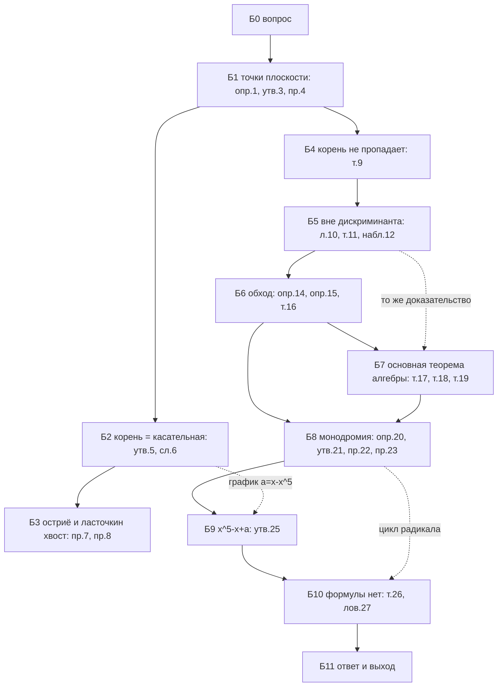

# PLAN — статья «Геометрия дискриминанта» по блокам

> Порядок рассказа. Строгие формулировки и доказательства — `SKELET.md` (номера в скобках), находки и источники —
> `KARTOCHKI.md`. Формулировки здесь — полностью; доказательства — ходами. У каждого блока: **цель** · **вход** ·
> **формулировки** · **ходы** · **что как подаётся** (в тексте / формулой-выносом / под спойлером / в сноске) · **🖼** · **ловушка**.
> Решения, помеченные **[А]**, принял аналитик по умолчанию (интервью №2 не было — владелец на лекции); их видно и легко отменить.

**Заголовок [А].** «Геометрия дискриминанта» с подзаголовком «почему у уравнения пятой степени нет формулы».
(Кандидат владельца — «…из геометрии дискриминанта».)

**Линия рассказа [А], одной фразой.** Корни многочлена — функции его коэффициентов; в вещественном мире дискриминант —
стена, за которой корни исчезают, а в комплексном — несколько «столбов», вокруг которых можно ходить: корней всегда
поровну, но, обойдя столб, они меняются местами, — и именно эти перестановки мешают формуле для уравнения пятой степени.

**Две половины (решение владельца 16:39).** Б1–Б5 — вещественный мир до конца; переход Б5→Б6 — что обобщается, а что
нет; Б6–Б10 — комплексный мир. Граница — явный заголовок второй половины.

**Семейство пятой степени [А]:** $x^5-x+a$, как у Фукса — Табачникова (SKELET зам. 24): база $a=0$ даёт корни $0,\pm1,\pm i$,
две точки дискриминанта видны на графике. На лекции было $x^5+x+a$ — отменяется одной заменой.

**Исторические отступления (решение владельца 16:28)** — короткими абзацами-врезками внутри блоков, только факты
«подтверждён двумя» из `KARTOCHKI.md` § История: Х-1 Кардано и Тарталья (Б0), Х-2 Лагранж и перестановки (Б8),
Х-3 Руффини и Абель (Б10), Х-4 Галуа (Б10), Х-5 Арнольд в ФМШ (Б10/Б11).

**Объём.** Как у Гильберта по времени чтения (15–20 мин): основной текст ≈ `wc -w ../tretya-problema-gilberta/LENTA/lenta.md`
без SVG; всё строгое сверх идеи — под спойлеры и в сноски. Снимать на Ш3 командой
`python3 - <<<'import re;t=open("LENTA/lenta.md").read();print(len(re.sub(r"<svg.*?</svg>","",t,flags=re.S).split()))'`.

---

## Б0 · Вопрос

- **Цель:** поставить вопрос о формуле так, чтобы «нет формулы» стало осмысленным утверждением; инструмент не называть (С2).
- **Вход:** школьная формула квадратного уравнения.
- **Формулировки.** Вопрос (2 фразы, разные зачины): у квадратного уравнения есть формула через коэффициенты; у уравнений
  третьей и четвёртой степени — тоже; а у пятой? Ответа не даём.
- **Ходы.** Абзац контекста: Х-1 (Кардано, «Ars Magna», 1545; формулы третьей и четвёртой степени — Тарталья, Феррари).
  Последняя фраза — куда идём: «посмотрим на сами многочлены как на точки и проследим, как от них зависят корни».
- **Подача:** проза. **🖼** нет.
- **Ловушка:** не называть монодромию, перестановки и «топологию» во вступлении.

## Б1 · Многочлены — точки плоскости

- **Цель:** увидеть пространство многочленов и дискриминант как кривую.
- **Вход:** Б0.
- **Формулировки.** Опр. 1 (точка $(p,q)$ ↔ $x^2+px+q$). Опр. 2 и утв. 3 (кратный корень ⇔ $f(x_0)=f'(x_0)=0$ ⇔ график
  касается оси). Пример 4: $p^2-4q$, парабола $q=p^2/4$, области «два корня»/«нет корней».
- **Ходы.** Каждая точка плоскости — многочлен; двигаем точку — график ездит; на параболе — касание.
- **Подача:** опр. 2 и утв. 3 — формальная врезка; доказательство утв. 3 (Безу) — спойлер в одну строку.
- **🖼** Р1 + симуляция С1 (см. план рисунков).
- **Ловушка:** «дискриминант» в статье — и число $D$, и кривая $\Delta$; разводить словами («дискриминантная кривая»).

## Б2 · Корень — это касательная

- **Цель:** главная картинка вещественной половины: корень читается по касательной к дискриминанту.
- **Вход:** Б1.
- **Формулировки.** Утв. 5 (многочлены с корнем $t$ — прямая $L_t$, касается параболы в $(x-t)^2$). Сл. 6 (число
  вещественных корней = число касательных через точку; замечание про вертикальные прямые — сноска).
- **Ходы.** «Какие многочлены имеют корень 1? — прямая. А корень $t$? — семейство прямых, все касаются параболы».
- **Подача:** утв. 5 с доказательством в две строки (формула $(p+2t)^2$ выносом) — в тексте, не в спойлере.
- **🖼** Р2 (касательные из точки) — внутри С1.
- **Ловушка:** не путать $t$ (корень) и наклон $-t$.

## Б3 · Дальше картина та же: остриё и ласточкин хвост

- **Цель:** показать, что парабола — не случайность (решение владельца: абзац без новой математики + ласточкин хвост).
- **Вход:** Б2.
- **Формулировки.** Пример 7 (полукубическая парабола, параметризация $p=-3t^2$, $q=2t^3$, внутри клюва три корня).
  Пример 8 (ласточкин хвост: три области 0, 2, 4 корня; сечения $a=\text{const}$).
- **Подача:** один-два абзаца; формулы параметризаций — выносом; «ус» $\{D=0\}$ и неограниченность — не упоминать
  (только в SKELET).
- **🖼** Р3 (остриё с касательной), Р4 (ласточкин хвост: объёмная картинка или три сечения в ряд) — обязательный.
- **Ловушка:** при $a=0$ сечение — НЕ остриё (рецензент); на рисунке три сечения подписывать знаками $a$ только в подписи.

## Б4 · Корень не пропадает

- **Цель:** главный трудный ход лекции — понять, что корень непрерывно едет за коэффициентами.
- **Вход:** Б1 (простой корень, $f'(x_0)\ne0$).
- **Формулировки.** Т. 9 полностью (для любого малого $\varepsilon$ найдётся $\delta$…).
- **Ходы.** Сначала неформально — касательная (довод владельца); затем «как это сказать строго» — два шага.
- **Подача:** неформальный довод — в тексте с рисунком; строгое доказательство — спойлер «Шаг 1 (существование) /
  Шаг 2 (единственность)» (МБ5); идея до доказательства (МБ1).
- **🖼** Р5 (график возле простого корня, касательная, сдвинутый график, отрезок $[x_0-\varepsilon,x_0+\varepsilon]$).
- **Ловушка:** единственность не «обратным рассуждением», а монотонностью (поправка П5).

## Б5 · Пока не задеваем дискриминант

- **Цель:** из локального сделать глобальное: на пути вне дискриминанта корни — непрерывные функции, число постоянно;
  стена — дискриминант.
- **Вход:** Б4.
- **Формулировки.** Л. 10 (корни в круге $|x|\le1+\max|a_i|$) — сноска. Т. 11 (на пути вне $\Delta$ число корней
  постоянно, корни — непрерывные функции). Набл. 12.
- **Ходы.** Покрываем путь интервалами (так было на лекции); компактность отрезка — названный факт со сноской
  (решение владельца 16:26); минимум на замкнутом ограниченном множестве — тоже назвать.
- **Подача:** т. 11 — врезка; доказательство — спойлер (Шаг 1 локально / Шаг 2 по всему пути).
- **Переход ко второй половине (абзац):** что обобщается (сама т. 9 — формулировка, т. 11), что нет (знаки, «стена»).
  Вопрос-крючок: «а если бы стену можно было обойти?»
- **🖼** нет (или маленький Р1-бис: путь внутри области).
- **Ловушка:** не обещать, что корень можно продолжить через $\Delta$.

---
## Вторая половина: комплексные корни

## Б6 · Дискриминант можно обойти

- **Цель:** вторая главная картинка: в $\mathbb C^n$ дискриминант не разделяет.
- **Вход:** Б5.
- **Формулировки.** Опр. 14 (результант — описанием: «выражение от коэффициентов, обращается в ноль ⇔ общий делитель»;
  Сильвестр с примером — сноска). Опр. 15 ($D(f)=R(f,f')$; вне $\Delta$ все корни простые). Т. 16 полностью.
- **Ходы.** Эвристика размерности (одно комплексное уравнение = два вещественных, «точка на плоскости»); затем строго:
  комплексная прямая через две точки, на ней дискриминант — конечное число точек, обходим.
- **Подача:** т. 16 — врезка + доказательство в тексте (оно короткое и красивое — «классная мысль»); выделить формулой
  $s\mapsto D\big((1-s)f+sg\big)$.
- **🖼** Р6 (плоскость $s$ с конечным числом выколотых точек, путь от 0 к 1 с обходами).
- **Ловушка:** определение $\Delta$ — через результант, не «кратный корень» (круг в Б7; поправка П6) — в тексте одной
  фразой-оговоркой, без слова «круг».

## Б7 · Сколько корней у многочлена

- **Цель:** первый урожай обхода — основная теорема алгебры.
- **Вход:** Б6, Б5.
- **Формулировки.** Т. 17 — формулировка + оговорка «знаков нет, нужен другой довод», сноска с идеей числа оборотов
  (решение владельца 16:21). Т. 18 (то же, что т. 11). Т. 19 (основная теорема алгебры).
- **Ходы.** Соединяем любой многочлен вне $\Delta$ с $x^n-1$ (корни — вершины правильного $n$-угольника); число корней
  по дороге не меняется ⇒ $n$ корней. Многочлены на $\Delta$ — спойлер (индукция через общий делитель с $f'$).
- **Подача:** т. 19 — врезка; основная идея — в тексте; случай $f\in\Delta$ — спойлер; сноска «другое доказательство —
  число оборотов большой окружности» (добавление владельца 16:39).
- **🖼** Р7 (корни $x^n-1$ на окружности и путь к другому многочлену — можно частью С2).
- **Ловушка:** доказательство т. 17 сжатием — только в SKELET; в статье оговорка и сноска.

## Б8 · Обойдя столб, корни меняются местами

- **Цель:** второй урожай и главный герой статьи — монодромия.
- **Вход:** Б6, Б7.
- **Формулировки.** Опр. 20 (перестановка корней вдоль замкнутого пути — монодромия). Пример 22 ($x^2+\lambda$,
  транспозиция). Пример 23 ($x^n+\lambda$, цикл). Утв. 21: (а) малое шевеление пути не меняет перестановку; (б) обратный
  путь — обратная перестановка; (в) обходы складываются — перестановки перемножаются (добавление владельца 16:39).
- **Ходы.** Сначала пример $x^2+\lambda$ с симуляцией; потом определение; потом свойства (а)–(в) — коротко, по строке.
  Х-2 (Лагранж, 1770–1771: впервые изучает перестановки корней) — врезкой здесь.
- **Подача:** опр. 20 — врезка; свойства — список из трёх строк с объяснением в одно предложение («перестановка —
  дискретная величина, а корни едут непрерывно»).
- **🖼** С3 (симуляция $x^2+\lambda$), Р8 (статичный кадр: петля $\lambda$ и пол-оборота корней), Р9 (корни $x^5+\lambda$,
  поворот на $1/5$).
- **Ловушка:** порядок композиции не обсуждать (SKELET 21в — договорённость).

## Б9 · Пятая степень: все перестановки

- **Цель:** посчитать монодромию $x^5-x+a$ и увидеть все 120 перестановок.
- **Вход:** Б8.
- **Формулировки.** Утв. 25: (а) четыре точки дискриминанта $\pm a_*$, $\pm ia_*$, $a_*=\frac45 5^{-1/4}\approx0{,}535$;
  (б) из базы $a=0$ (корни $0,\pm1,\pm i$) обход каждой меняет местами $0$ с $1,-1,i,-i$; (в) такие обмены дают все
  перестановки.
- **Ходы.** Вещественная половина помогает: график $a=x-x^5$ (Р10) — видно, как при $a\to a_*$ сливаются корни 0 и 1.
  Симметрия $x\mapsto ix$ даёт мнимые точки. Почему транспозиция — «возле точки слияния всё как у $x^2+\lambda$».
  Обмены порождают всё: $(u\,v)=(0\,u)(0\,v)(0\,u)$, любая перестановка — произведение обменов.
- **Подача:** утв. 25 — врезка; (б) — наблюдение с симуляцией + довод симметрии в тексте; точный довод «локально
  $w^2$» — спойлер; (в) — в тексте, формула выносом.
- **🖼** С4 (главная симуляция: плоскость $a$ с четырьмя точками, кнопки-петли, плоскость $x$ с пятью цветными
  корнями и следами), Р10 (график $a=x-x^5$), Р11 (звезда обменов: пять корней, четыре ребра из $0$).
- **Ловушка:** какие корни меняются — зависит от петель; в тексте сказать «для петель из $a=0$ по отрезку».

## Б10 · Почему нет формулы

- **Цель:** сформулировать теорему точно и честно, без доказательства (решение владельца 16:17).
- **Вход:** Б9.
- **Формулировки.** Т. 26 (школьная формулировка: петли из общей точки $a_0$; не все 120). Вывод: формулы в радикалах
  для корней $x^5-x+a$ через $a$ нет; тем более — для общего уравнения. Ловушка 27.
- **Ходы.** Почему радикалы «мешают»: у $\sqrt[n]{\ }$ монодромия — цикл (Б8, пример 23), а из циклов не собрать все
  120 перестановок — это и есть суть доказательства Арнольда (одна фраза, без коммутаторов). Х-3 (Руффини 1799 — два
  тома и пробел; Абель 1824 — шесть страниц за свой счёт; 1826 — журнал Крелле; письмо из Берлина через два дня после
  смерти), Х-4 (Галуа), Х-5 (Арнольд, 1963–64, ФМШ № 18; книга Алексеева 1976).
- **Подача:** т. 26 — врезка; сноски: (1) точное условие — разрешимая группа, ссылки И3, И1; (2) многозначность и
  лишние значения формулы; (3) общее уравнение; ловушка 27 — абзац в тексте.
- **🖼** нет (исторические врезки — без портретов: CSP артефакта не пускает внешние картинки).
- **Ловушка:** «формулы нет» ≠ «конкретное уравнение не решается» — сказать прямо с примером $x^5-x-30$.

## Б11 · Ответ и куда дальше

- **Цель:** закольцевать вопрос (С2/финал Гильберта) и дать проектанту выход.
- **Вход:** Б10.
- **Ходы.** Ответ на вопрос из Б0 одной фразой. Куда дальше: Хованский (топологическая теория Галуа: монодромия
  функций, выражаемых квадратурами, разрешима), Канель-Белов и соавторы ($\tan x-x=a$ не решается в элементарных
  функциях, 2020). Финальная сноска: «на языке топологов — накрытие» (решение владельца 16:29).
- **🖼** нет.

---

## Граф зависимостей

Пунктир — педагогические связи: Б5→Б7 то же доказательство; Б8→Б10 «радикал даёт цикл»; Б2→Б9 вещественная картинка
помогает в комплексной задаче.

## План рисунков и симуляций (по `illustracii`)

Все рисунки — инлайновый `<svg>` в `<figure>` с `<figcaption>`, классы `.s-*` doc-вида, фон — доска, внутри только метки.
У каждой симуляции — статичный кадр-заглушка (печать, без JS). Носитель JS в `build_doc.py` — проверить на Ш3/Ш4.

| id | блок | тип | что | буквы внутри |
|---|---|---|---|---|
| Р1 | Б1 | grafik | плоскость $(p,q)$, парабола, области «2» и «0» заливкой | оси $p$, $q$ |
| С1 | Б1–Б2 | симуляция | слева плоскость $(p,q)$: тянем точку; касательные к параболе из неё; справа график $y=x^2+px+q$ с корнями; корень = минус наклон касательной (цвет связывает корень и касательную) | оси |
| Р2 | Б2 | grafik | статичный кадр С1: точка снаружи, две касательные | оси |
| Р3 | Б3 | grafik | полукубическая парабола $4p^3+27q^2=0$, клюв (3 корня) заливкой, одна касательная $L_t$ | оси |
| Р4 | Б3 | grafik | ласточкин хвост: три сечения $a>0$, $a=0$, $a<0$ в ряд, область «4» заливкой; либо объёмный вид (threejs — на Ш4, если позволит носитель) | оси $b$, $c$ |
| Р5 | Б4 | grafik | график возле простого корня, касательная пунктиром, сдвинутый график акцентом, отрезок $[x_0\pm\varepsilon]$ | ось $x$ |
| Р6 | Б6 | konstrukciya | плоскость $s$: точки 0 и 1, крестики-запретные точки, путь с полуокружностями | нет (точки 0, 1 — координаты) |
| Р7 | Б7 | grafik | корни $x^n-1$ на окружности ($n=5$) | нет |
| С3 | Б8 | симуляция | $x^2+\lambda$: $\lambda$ бежит по окружности, два корня поворачиваются на пол-оборота, следы | оси Re, Im |
| Р8 | Б8 | grafik | кадр С3: петля $\lambda$ и дуги корней | нет |
| Р9 | Б8 | grafik | $x^5+\lambda$: пять корней, стрелки поворота на $1/5$ | нет |
| Р10 | Б9 | grafik | график $a=x-x^5$, уровни $\pm a_*$ пунктиром, точки слияния | оси $x$, $a$ |
| С4 | Б9 | симуляция | плоскость $a$: база 0, четыре точки, четыре петли (кнопки или перетаскивание); плоскость $x$: корни $0,\pm1,\pm i$ цветами, следы; счётчик-перестановка | оси; метки корней $0,\pm1,\pm i$ |
| Р11 | Б9 | sootvetstvie | звезда обменов: пять узлов, четыре ребра из центра | нет |

## Что режем (граница)

- Доказательство т. 26 (коммутаторы Арнольда) — только одна фраза-идея и ссылки.
- Определитель Сильвестра — сноска с одним примером; формулы Кардано и Феррари — не выписываем.
- Доказательство т. 17 сжатием, лемма 18а, равномерность в 21а — только SKELET.
- «Ус» дискриминанта и неограниченность пирамиды ласточкина хвоста — только SKELET.
- Теория Галуа и неразрешимость конкретных уравнений ($x^5-x-1$) — одна фраза в ловушке 27.
- Кривая $(P,P')$ Васильева и метод Штурма — не трогаем.
