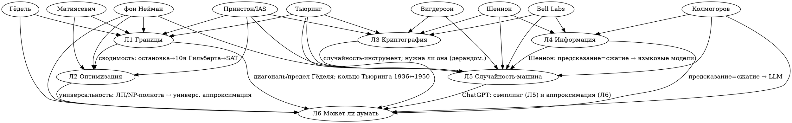

# ГРАФ-ПАУТИНА — узлы, рёбра, плотность (visual-ready под лендинг)

> Выход прогона «сборка клубка» (2026-06-28). Узлы: 6 лекций + люди + места + идеи. Рёбра — нити §14.2, КАЖДАЯ проверена на реальность (§14.9). Внизу — подсчёт типизированных квот §14.3 с честными пометками «3, не 4».

## Архитектура набора (6 лекций)

| # | Лекция | Роль |
|---|--------|------|
| **Л1** | Границы возможного: чего машина не может (Тьюринг + Гёдель) | вход / структурный хребет |
| **Л2** | Оптимизация: что машина может, но дорого (симплекс · Канторович · P=NP) | ядро / тело |
| **Л3** | Криптография: случайность как доказательство (Миллер–Рабин + ZKP) | ядро / тело |
| **Л4** | Информация: измерить и защитить знание (Wordle · Шеннон · Хэмминг) | ядро / тело |
| **Л5** | Случайность как машина: от пасьянса до ChatGPT (Монте-Карло + Марков + MCMC) | ядро / продажник |
| **Л6** | Может ли машина думать: универсальная аппроксимация и предел (финал) | финал / замыкает кольцо к Л1 |

**Решение прогона:** Монте-Карло + Марков слиты в Л5 (MCMC = Монте-Карло на цепях — чистейшая унификация; снимает перекос-в-вероятность 3→2 лекции). Освободившийся слот → **финал-синтез «может ли машина думать»** — замыкает кольцо: курс открывается пределом Тьюринга (1936) и закрывается вопросом Тьюринга (1950). Обоснование — `dokazatelstvo.md`.

---

## РЁБРА ПО ТИПАМ НИТЕЙ (§14.2)

Обозначения: **[тело]** — биографический/содержательный бит; **[wink]** — подмигивание/упоминание; реальность каждого ребра — в `deystvuyushchie-lica.md` / `teorii.md` и в фактчеке (см. отчёт).

### Тип 1 — ДЕЙСТВУЮЩИЕ ЛИЦА (кочующие, 2–5 лекций)
| Человек | Л1 | Л2 | Л3 | Л4 | Л5 | Л6 | # | оценка |
|---|----|----|----|----|----|----|----|----|
| **фон Нейман** | wink (теоретик vs машина) | **тело** (Принстон 1947, двойственность ЛП за час) | — | — | **тело** (письмо Улама → MANIAC; сред.квадраты 1946) | wink (самовоспр. автоматы → клет. автоматы) | **4** | 4 |
| **Тьюринг** | **тело** (машина + остановка 1936) | — | wink (Тьюринг-премия / Энигма) | — | wink («Turing's Cathedral») | **тело** (1950 «может ли думать») | **4** | 4 |
| **Шеннон** | — | — | **тело** (SIGSALY 1945 — доказал нераскрываемость линии Черчилль–Рузвельт; one-time pad) | **тело** (энтропия + коды) | wink (Prediction & Entropy of English → LLM) | — | **3** | 4 |
| **Колмогоров** | — | — | — | wink (колмог. сложность ↔ энтропия) | **тело** (основания вероятности 1933 + цепи Маркова) | wink (Колмогоров–Арнольд 1957 → KAN 2024) | **3** | 3–4 |
| **Гёдель** | **тело** (неполнота 1931; Принстон, Эйнштейн) | — | — | — | — | wink (предел Гёделя в силе для ИИ-золота IMO) | **2** | 3 |
| **Матиясевич** | wink (10-я пр. Гильберта — ещё одна неразрешимость) | **тело** (звено сводимости → Кук–Левин SAT; 22 года, Фибоначчи, 1970) | — | — | — | — | **2** | 3 |
| **Вигдерсон** | — | — | **тело** (ZKP для всего NP, Гольдрайх–Микали–Вигдерсон 1991; Абель-2021) | — | wink (Нисан–Вигдерсон 1994: нужна ли случайность) | — | **2** | 3 |

→ **7 кочующих людей** в квоте 5–8 (цель ~6). ✅
Сильные **портреты-якоря 1 лекции** (НЕ кочуют — честно): **Канторович** (Л2), **Улам** (Л5), **Хэмминг** (Л4), **Данциг** (Л2), **Марков** (Л5). Идут в раздел «Действующие лица» карточками, но не засчитываются в кочующую квоту.

### Тип 2 — МЕСТА И ИНСТИТУЦИИ
| Нить | Лекции | # |
|---|---|---|
| **Принстон / IAS** (Гёдель, фон Нейман, Эйнштейн, Тьюринг 1936–38; встреча с Данцигом 1947; Вигдерсон; ядерная верификация ZKP 2014–16) | Л1, Л2, Л3, Л5 | **4** |
| **Bell Labs** (Шеннон + Хэмминг — коллеги 1947–48; Шеннон-секретность; Prediction-статья) | Л4, Л3, Л5 | **3** |
| **Лос-Аламос / Манхэттен** (Улам, фон Нейман, Метрополис, MANIAC, нейтроны бомбы) | Л5 | 1 (сильная сцена) |

### Тип 3 — ЭПОХА / ОСЬ ВРЕМЕНИ / СОБЫТИЕ
| Нить | Лекции | # |
|---|---|---|
| **Ось 1936–1950 (рождение машины)** — Turing 1936, Gödel 1931, vN-Данциг 1947, Канторович 1939, Шеннон 1948, Хэмминг 1950, Улам/vN 1946, Turing-вопрос 1950 | Л1, Л2, Л4, Л5, Л6 | **5** ✅ (Л3 — контролируемое исключение: ядро 1970–80-е, корень Шеннон-1949) |
| **Вторая мировая как задник** (Энигма; Данциг ВВС / Канторович блокада; бомба Лос-Аламос; Шеннон военная крипто Bell Labs) | Л1, Л2, Л4, Л5 | **4** |

### Тип 4 — СТРАНА / ГЕОГРАФИЯ (дополняющее разнообразие, §14.4)
| Нить | Лекции | # |
|---|---|---|
| **США** (Принстон, Bell Labs, Лос-Аламос, Корнелл) | Л1–Л6 | 6 |
| **СССР / Россия** (Канторович, Левин — Л2; Колмогоров, Марков — Л5; Матиясевич — Л1/Л2) — нить-РИФМА «в разных странах наткнулись на одну стену» | Л1, Л2, Л5 | **3** |
| Британия (Тьюринг) · Австрия/Вена (Гёдель) — точечно | Л1, Л6 | — |

> **Честно (§14.9):** «советская параллель» — это нить типа СТРАНА/ЭПОХА (легитимна по §14.2), а **НЕ** живой людской мост. Канторович/Левин/Матиясевич/Колмогоров **не встречаются в телах лекций вместе** — они рифмуются контекстом «одновременно и независимо в другой стране». Так и подаём, не выдавая за кочующих людей.

### Тип 5 — МАТЕМАТИЧЕСКИЕ ИДЕИ-ТЕОРИИ (одна на лекцию = связность; раздел сайта «Теории»)
Л1 вычислимость/теория множеств · Л2 линейное программирование + теория сложности · Л3 теория чисел + рандомизированные алгоритмы + теоретико-информац. стойкость · Л4 теория информации + теория кодирования · Л5 теория вероятностей + цепи Маркова + Монте-Карло · Л6 теория аппроксимации. Подробно — `teorii.md`.

### Тип 6 — МАТЕМАТИЧЕСКИЕ РИФМЫ (один приём в разных костюмах)
| Рифма | Лекции | # | реальность |
|---|---|---|---|
| **Предел / невозможность / нижняя граница** — что не вычислить вообще (остановка), что не быстро (NP), сколько минимум нужно ключа (perfect secrecy: ключ ≥ сообщения), граница Хэмминга/Шеннона, предел Гёделя для ИИ | Л1, Л2, Л3, Л4, Л6 | **5** | ✅ хребет манифеста |
| **Сводимость / универсальность** (мета-рифма) — машина Тьюринга считает всё · ЛП-полнота + NP-полнота (всё сводится к SAT) · универсальная аппроксимация (сеть приближает любую функцию). Цепь-сводимость: остановка→10-я Гильберта→SAT | Л1, Л2, Л6 (+ Л1–Л2 цепь) | **3** | ✅ |
| **Спрятанная геометрия** — коды = точки в кубе (Хэмминг) · ЛП = вершины многогранника · крипто = модулярная/эллиптическая геометрия · аппроксимация = ступеньки-кирпичики | Л2, Л3, Л4, Л6 | **4** | ✅ |
| **Человек → машина** — 9 клерков диеты Стиглера · ENIAC считает нейтроны вместо физиков · Марков вручную 20 000 букв → языковая модель · перцептрон учится сам · ИИ берёт золото IMO | Л1, Л2, Л5, Л6 | **4** | ✅ тематический хребет вопроса курса |
| **Предсказание = сжатие** — энтропия Шеннона → LLM-как-компрессор (GPT > gzip, теорема) → предсказание токена | Л4, Л5 (+ Л6) | **2–3** | ✅ (Delétang ICLR-2024) |
| **Случайность как инструмент** — монетка вместо точного ответа (Миллер–Рабин · Монте-Карло · MCMC) + поворот «а нужна ли она» (дерандомизация) | Л3, Л5 | **2** | ✅ честный мотив-рифма 2 лекций (не «во всех 6») |
| **Диагональ / самоссылка** — лжец → Гёдель → остановка; тот же парадокс «программа наоборот» в финале | Л1, Л6 | **2** | ✅ |

### Тип 7 — ФОРМАТ-АРКИ / СЛОГАНЫ (соединяющая ИДЕЯ формата)
| Нить | Лекции | # |
|---|---|---|
| **Discovery-fiction: естественный вопрос → переоткрытие руками → «в кармане» → живой фронтир** | Л1–Л6 | **6** |
| **Мастер-арка «элементарная математика → нетривиальное современное приложение»** | Л1–Л6 | **6** |
| **Выход на открытую проблему / незатухающий фронтир** (BB(5)/Collatz; P=NP; пост-квант; LLM-сжатие; джерримендеринг-суды; «может ли думать») | Л1–Л6 | **6** |

### Тип 8 — «В КАРМАНЕ» И МАШИНЫ
| Подтип | Л1 | Л2 | Л3 | Л4 | Л5 | Л6 |
|---|----|----|----|----|----|----|
| **в кармане** (бронебойное) | IDE/компиляторы; ИИ-доказатели | Amazon-логистика, авиарасписания, верификация чипов Intel | HTTPS/RSA, Zcash/блокчейн, ядерная верификация | ZIP/JPEG/MP3, QR, ECC Google, «Вояджер» | PageRank, риски/финансы/CERN, случайность ChatGPT, джерримендеринг | нейросети, ChatGPT |
| **машина-визуал** | лента Тьюринга; ENIAC | линейка-целевая-функция + диета (демо) | **SIGSALY** (вертушки с пластинками); опц. Энигма/Бомба | перфокарты Хэмминга; реле Шеннона | ENIAC/MANIAC/FERMIAC, доска Гальтона, дартс | **Mark I Perceptron** (1960), глайдеры Игры жизни |

→ **в кармане: 6/6 бронебойных** ✅. **Машина-визуал после КРУГА 2: 5/6 на «4»** (Л1,Л3-SIGSALY,Л4,Л5,Л6); **Л2 — «3»** (нет машины, но появилась зальная демонстрация «скользящая линейка» + игра-диета → щупаемость Н-ε поднята).

---

## ПОДСЧЁТ КВОТ §14.3 (честный, с пометками)

| Квота | Порог | Факт | Статус |
|---|---|---|---|
| Действующие лица | 5–8, каждый в 2–5 лекциях | **7** (фон Нейман 4 · Тьюринг 4 · Шеннон 3 · Колмогоров 3 · Гёдель 2 · Матиясевич 2 · Вигдерсон 2) | ✅ (часть появлений — winks; см. оценки) |
| Сквозные линии ≥5 из 6 | ≥3 | **4**: предел/нижняя граница [5] · ось времени 1936–50 [5] · формат-арка переоткрытие→карман→фронтир [6] · мастер-арка элем.→в кармане [6] | ✅ |
| Нити через ≥4 лекции | ≥6 | **11**: предел [5] · время [5] · WWII [4] · Принстон [4] · человек→машина [4] · спрятанная геометрия [4] · фон Нейман [4] · Тьюринг [4] · формат-арка [6] · мастер-арка [6] · в-кармане [6] | ✅✅ |
| Парные нити (2–4 лекции) | ≥10 | **≥15**: Шеннон · Колмогоров · Гёдель · Матиясевич/сводимость · Вигдерсон/дерандом. · случайность-инструмент · предсказание=сжатие · диагональ · сводимость/универсальность · Bell Labs · советская параллель · ChatGPT-в-кармане · колмог. сложность · ENIAC · СССР-страна | ✅✅ |
| Каждая лекция ≥5 нитей | все 6 | мин. у Л3 ≈ 7 нитей ≥5 типов | ✅ нет «торчащих» |
| ≥4 типа нитей | ≥4 | **8/8 типов** реально представлены | ✅✅ |
| 0 тем-сирот | 0 | 0 | ✅ |

**Итог графа:** все 7 квот §14.3 проходят реальными связями. Слабые места честно помечены (winks в людях; машина-визуал Л2/Л3 = 3; «советская параллель» переклассифицирована из людей в страну/эпоху). Детальный scorecard 0–4 — `scorecard.md`.

---

## DOT-описание графа (для рендера визуала)

