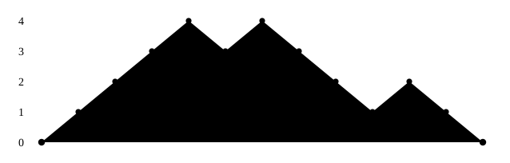
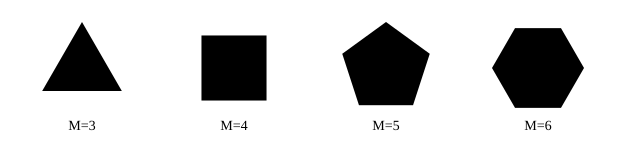
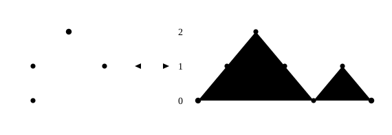
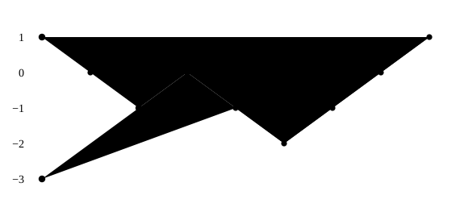
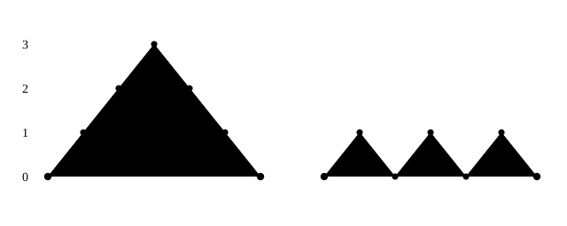

# Пути и волны: рассказ на год

## Глава 1. Две дроби <!--id: rasskaz-g1--> [[p-01]] [[p-15]]

*$$\cfrac{e^{-2\pi/5}}{1+\cfrac{e^{-2\pi}}{1+\cfrac{e^{-4\pi}}{1+\cfrac{e^{-6\pi}}{1+\ddots}}}}\;=\;\sqrt{\frac{5+\sqrt5}2}-\frac{\sqrt5+1}2$$*

К этой формуле мы вернёмся на последней странице главы. Пока я не буду её объяснять — я даже не скажу, откуда она взялась.

### Коридор

Начну с задачи, которую можно объяснить ребёнку. Из неё вырастет всё остальное.

Возьмём полосу клеток — назовём её коридором — и запустим по ней точку. Каждый ход точка делает шаг влево или шаг вправо. За стенки выходить нельзя: дошла до края — следующий шаг обязан вести назад. Высотой коридора назовём число $m$ шагов между стенками, клеток тогда $m+1$; точка всегда стартует у левой стенки, а финиш свободный.

Спросим самое простое, что тут можно спросить:

> **сколько существует маршрутов данной длины?**

Больше в задаче ничего нет. Есть целое число — высота коридора, есть длина маршрута, и есть счёт. Ни экспонент, ни радикалов, ни какой бы то ни было теории тут пока не видно.

### Считаем руками

Высота 1. Клеток две, точка ходит туда-сюда, выбора у неё нет никогда. Маршрут ровно один, какой длины ни возьми: $1,1,1,1,1,\dots$

Поднимем потолок на одну клетку. Высота 2: $1,1,2,2,4,4,8,8,16,16,\dots$ — степени двойки, каждая по два раза: раз в два шага точка оказывается в средней клетке и получает настоящий выбор.

Ещё на клетку. Высота 3: $1,1,2,3,5,8,13,21,34,55,89,144,233,\dots$ Это числа Фибоначчи. Не «похожие на», не «связанные с» — ровно они, подряд, без единого пропуска. Высоту я не подбирал специально: просто поднял потолок ещё на клетку. И в задаче про хождение вдоль стенки завелась последовательность, которую записали за пятьсот лет до всякой комбинаторики в задаче про кроликов. Ни в постановке, ни в способе счёта нет ничего от Фибоначчи: числа появились как ответ, а не как замысел. Дальше вся лекция будет устроена так же — мы не подбираем задачу под известный ответ, мы задаём задаче простые вопросы и смотрим, что она отвечает.

Ещё на клетку. Высота 4: $1,1,2,3,6,9,18,27,54,81,162,243,486,\dots$ — степени тройки, снова по две штуки на этаж.

И ещё на одну. Высота 5: $1,1,2,3,6,10,19,33,61,108,197,352,638,\dots$ А у этой последовательности имени нет. Она не Фибоначчи, не степени, не Каталан; ни одна школьная формула её не даёт. Все пять строк получены прямым перебором по клеткам — циклом в шесть строк, без единой формулы.

### Тот же вопрос, заданный иначе

Список имён оборвался на четвёртой строке, и на этом стоит остановиться. Спросим не «чему равно число маршрутов», а «как быстро оно растёт». Каждая строка растёт как геометрическая прогрессия; выпишем её знаменатели:

| высота | последовательность | скорость роста |
|---|---|---|
| 1 | единицы | $1$ |
| 2 | степени двойки | $\sqrt2\approx1{,}41$ |
| 3 | Фибоначчи | $\varphi\approx1{,}618$ |
| 4 | степени тройки | $\sqrt3\approx1{,}73$ |
| 5 | имени нет | $\approx1{,}80$ |

Четыре первых числа — старые знакомые, и золотое сечение $\varphi$ стоит среди них третьим. Пятое ни на что не похоже. Почему список обрывается именно здесь, я расскажу в следующей главе; ответ там оказывается неожиданно жёстким и объясняет заодно, отчего у кристаллической решётки не бывает симметрии пятого порядка. Пока мне важно другое: **золотое сечение попало в эту таблицу не как красивая константа, а как ответ на вопрос о счёте маршрутов.** Мы его сюда не звали — оно получилось. (Скорость роста в строке $m$ равна $2\cos\frac{\pi}{m+2}$ — формулу я здесь не вывожу, она из главы 3, но численно её легко сверить: $2\cos\frac\pi5=\varphi$.)

### Первая дробь

У золотого сечения есть школьный портрет — бесконечная цепная дробь из одних единиц:

$$\xi\;=\;\cfrac1{1+\cfrac1{1+\cfrac1{1+\ddots}}}$$

Она вычисляется в одну строку: дробь повторяет саму себя, поэтому $\xi=\dfrac1{1+\xi}$, откуда $\xi^2+\xi-1=0$ и $\xi=\dfrac{\sqrt5-1}2=\dfrac1\varphi=0{,}6180\ldots$

Оборвём её на конечной высоте — получатся подходящие дроби $\frac12,\frac23,\frac35,\frac58,\frac8{13},\frac{13}{21},\dots$, и в числителях и знаменателях стоят ровно те числа, которые нам выдал коридор высоты 3. Дробь из единиц — это не отдельный сюжет про цепные дроби, а способ записать одну строку нашей таблицы. Обрыв дроби на конечной высоте и потолок коридора на конечной высоте — одно и то же действие; эту мысль стоит запомнить: в главе 4 из неё вырастет всё остальное, а в главе 5 она окажется единственной дорогой, которая уцелеет.

### Вторая дробь

Теперь вернёмся к формуле с первой страницы и положим её рядом с дробью из единиц:

$$\cfrac1{1+\cfrac1{1+\cfrac1{1+\ddots}}}\qquad\text{и}\qquad\cfrac{1}{1+\cfrac{e^{-2\pi}}{1+\cfrac{e^{-4\pi}}{1+\ddots}}}$$

Устроены они одинаково. Разница ровно одна: слева на всех этажах стоят единицы, справа этажи убывают как $e^{-2\pi},e^{-4\pi},e^{-6\pi}$ — то есть как степени одного числа.

Шестнадцатого января 1913 года эта формула пришла в Тринити-колледж из Мадраса — вместе с десятками других, почти все без доказательств. Отправитель, клерк портового треста двадцати пяти лет, университета не кончал. Получатель, Годфри Харолд Харди, к тому времени привык к письмам от людей, доказавших великую теорему Ферма на трёх страницах, и сел читать без особых надежд. Часть утверждений он узнал: их знали и до того. Часть разобрал за вечер. И была третья часть.

Двадцать семь лет спустя Харди вспоминал, что формулы этого сорта «разбили его наголову» и что он никогда не видел ничего похожего: написать такое, заключил он, мог только математик высшего класса, и они обязаны быть верны — потому что, не будь они верны, ни у кого не хватило бы воображения их выдумать. Поражала тут не сложность — считать Харди умел. Поражало, что формулу неоткуда взять: профессиональный аналитик смотрит на неё и не может угадать даже, из какой области математики она пришла.

### Утверждение, которое я пока не докажу

Две дроби на этой странице — одна и та же дробь. Между ними ровно один переключатель. Он не в анализе, не в теории чисел и не в теории эллиптических функций, где Харди его искал. Он в задаче про точку в коридоре, и додуматься до него может всякий, кто посмотрит на неё десять минут.

Скажу сразу, чем он не будет. Это не переход к пределу, не аналитическое продолжение и не замена переменной. Это **второй счётчик**. Мы весь этот разговор считали у маршрута одну-единственную величину — его длину. Стоит начать считать у него ещё кое-что, и дробь из единиц превратится в дробь из письма.

Что именно — в четвёртой главе. А до неё нам предстоит выяснить, почему список имён оборвался на четвёрке, и научиться считать одно и то же число тремя разными способами.

## Глава 2. Коридор <!--id: rasskaz-g2--> [[p-16]] [[p-17]]

В первой главе я оставил незакрытым долг. Мы подняли потолок пять раз подряд, получили единицы, степени двойки, Фибоначчи, степени тройки — и на пятой высоте имена кончились. Я сказал тогда, что ответ жёсткий, и отложил его. Пора платить.

Но сначала назову объект как следует. Коридор задаётся числом $m$ — высотой; клетки занумерованы $0,1,\dots,m$. У маршрута есть старт $x$, финиш $y$ и длина $N$ — число шагов, каждый ведёт на клетку вверх или вниз. Собрать все маршруты в одну функцию можно так:

$$F_m(x,y;\,z)\;=\;\sum_{\gamma:\,x\to y} z^{\,|\gamma|},$$

где сумма берётся по всем маршрутам из $x$ в $y$, а $|\gamma|$ — длина маршрута. Коэффициент при $z^N$ — это в точности число маршрутов длины $N$; переменная $z$ заведена только для того, чтобы держать все ответы сразу. Позже к ней добавится пятая величина — площадь под маршрутом, — и вот тогда начнётся интересное; пока её нет, только назову: маршрут — ломаная, а у ломаной есть площадь под ней.

### Ход, который всё решает

Число маршрутов растёт как геометрическая прогрессия, и знаменатели прогрессии мы выписали: $1,\ \sqrt2,\ \varphi,\ \sqrt3,\ 1{,}8019\ldots$ Первые четыре — старые знакомые. Пятое — ни на что не похоже. Спрашивается: чем провинилась пятая высота? Соблазнительно ответить «ничем, просто дальше формулы некрасивые» — такой ответ был бы враньём: список обрывается не по вкусу, а по теореме.

Ход состоит в том, чтобы посмотреть не на само число, а на его квадрат.

| высота $m$ | рост | квадрат роста |
|---|---|---|
| 1 | $1$ | $1$ |
| 2 | $\sqrt2\approx1{,}414$ | $2$ |
| 3 | $\varphi\approx1{,}618$ | $2{,}618\ldots$ |
| 4 | $\sqrt3\approx1{,}732$ | $3$ |
| 5 | $1{,}8019\ldots$ | $3{,}2469\ldots$ |
| 6 | $1{,}8477\ldots$ | $3{,}4142\ldots$ |

Целые числа стоят в строках 1, 2 и 4 — и больше нигде. А имена у последовательностей нашлись в строках 1, 2, 3 и 4. Строка 3 выбивается: имя есть, а квадрат не целый. К ней вернусь через минуту — она и окажется самой интересной.

Скорость роста в коридоре высоты $m$ равна $\lambda_m=2\cos\frac{\pi}{M}$, $M=m+2$ (откуда именно — разговор четвёртой главы, там косинус придёт из краевых условий). Возведём в квадрат: $\lambda_m^2=4\cos^2\frac\pi M=2+2\cos\frac{2\pi}M$ — школьная формула половинного угла, и она делает всю работу. Квадрат скорости роста целый тогда и только тогда, когда целым оказывается $2\cos\frac{2\pi}M$. А про это выражение известен точный ответ (это частный случай теоремы Нивена о рациональных значениях косинуса в рациональных долях $\pi$): число $2\cos\frac{2\pi}M$ бывает целым ровно при $M=1,2,3,4,6$ и ни при каких других. Наш $M=m+2$ не меньше трёх, так что остаются $M=3,4,6$, то есть

$$\boxed{m=1,\;2,\;4.}$$

Ровно те три строки, где в таблице стоят целые. Список закрыт, и закрыт навсегда.

### Где вы это уже видели

Список $1,2,3,4,6$ выглядит случайным набором, но математик, работавший с кристаллами, узнаёт его мгновенно. Возьмём периодическую решётку на плоскости и спросим, поворотом на какой угол её можно перевести в себя: ось порядка $M$ означает поворот на $2\pi/M$. У периодической решётки бывают оси порядка 1, 2, 3, 4 и 6 — и никаких других. Это кристаллографическое ограничение, и доказывается оно ровно тем же условием: след поворота на плоскости равен $2\cos\frac{2\pi}M$, а в базисе решётки матрица поворота целочисленна, значит и след обязан быть целым. Оба сюжета — про одно: оператор с целыми коэффициентами. У кристалла это поворот в базисе решётки, у нас — оператор шага в базисе клеток; целые матрицы имеют целые следы, а след есть сумма собственных чисел.

Одно и то же условие — целость $2\cos\frac{2\pi}M$ — запрещает пятиугольную симметрию у кристалла и обрывает нашу лестницу имён.

### Строка, которая выбилась

Вернёмся к третьей строке. Высота 3, числа Фибоначчи, рост $\varphi$, квадрат $\varphi^2=\varphi+1=2{,}618\ldots$ — не целое. По нашему критерию имени быть не должно. Имя есть.

Здесь нет противоречия, есть уточнение. Целость — условие того, что скорость роста лежит в самом простом из возможных мест. Фибоначчи в него не попадают, но попадают в соседнее: $\varphi$ удовлетворяет уравнению $\varphi^2=\varphi+1$, то есть является корнем квадратного трёхчлена с целыми коэффициентами. Этого хватает, чтобы у последовательности была замкнутая формула — формула Бине, — и хватает, чтобы у неё было имя.

А $M=3,4,5,6$ — это в точности треугольник, квадрат, пятиугольник и шестиугольник. Первые три (и шестиугольник) замощают плоскость. Пятиугольник — нет. Вот отчего $\varphi$ и выпадает из списка, оставаясь при этом знаменитым числом: оно живёт при $M=5$, отвечает пятиугольнику — единственной правильной фигуре из четырёх, которой нельзя замостить плоскость. Ровно поэтому в кристаллах нет оси пятого порядка, а в нашей таблице третья строка выглядит исключением. (Непериодические укладки с пятерной симметрией в природе встречаются; запрет касается именно решётки — периодической.)

Мы разобрались, почему имён мало, но всё это время держали концы маршрута закреплёнными и смотрели, как ответ зависит от потолка. Отпустим концы. Пусть маршрут начинается где хочет и кончается где хочет, а потолок, наоборот, уберём совсем. Тогда из одного и того же объекта посыплются вещи, которые в школьном курсе стоят в разных главах и считаются разными сюжетами.

## Глава 3. Зверинец <!--id: rasskaz-g3--> [[p-02]] [[p-06]] [[p-17]]

До сих пор мы держали концы маршрута закреплёнными и двигали потолок. Теперь сделаем наоборот: потолок уберём, а концы отпустим. Кажется, что задача от этого станет беднее — стенок меньше, считать проще. На деле из неё посыплется половина школьной комбинаторики.

### Стенок нет

Уберём обе стенки. Точка ходит по всей прямой, каждый шаг вверх или вниз, и никаких ограничений. Считать нечего: маршрутов длины $N$ ровно $2^N$, по два выбора на шаг. Интересно другое — куда она пришла. Если из $N$ шагов ровно $r$ были вверх, финиш находится на высоте $r-(N-r)$, а число таких маршрутов есть число способов выбрать, какие шаги пойдут вверх: $\binom{N}{r}$.

При $N=6$ маршруты распределяются по финишам так: $1,6,15,20,15,6,1$ — строка треугольника Паскаля, сумма $64=2^6$. Биномиальные коэффициенты обычно вводят как «число сочетаний» — сколько способов выбрать $r$ предметов из $N$. У нас они появились иначе: как ответ на вопрос, куда придёт блуждающая точка. Это не другое определение, а другой вход в то же понятие, и дальше он окажется удобнее.

### Одна стенка

Поставим пол. Точка стартует в нуле и не имеет права уходить ниже. Задача меняется до неузнаваемости: не всякий набор из $r$ подъёмов годится, годятся только те, где точка не провалилась. Маршруты, вернувшиеся в ноль за $2n$ шагов и ни разу не ушедшие ниже, — это классические **пути Дика**, и их число равно

$$C_n=\frac1{n+1}\binom{2n}n:\qquad 1,1,2,5,14,42,132,429,1430,\dots$$

Числа Каталана. Одна стенка — и вместо треугольника Паскаля появилось семейство, которое ведёт себя совсем иначе.

### Прямая — это луч, у которого старт отодвинут

Здесь пора сказать вещь, которая держит всю первую половину курса. Мы обращались с прямой и лучом как с двумя разными задачами. Это иллюзия. Возьмём луч, но стартуем не из нуля, а из клетки $x$, и посмотрим, сколько всего маршрутов длины 6 выходит из неё:

| старт $x$ | 0 | 1 | 2 | 3 | 4 | 5 | 6 | 7 |
|---|---|---|---|---|---|---|---|---|
| маршрутов | 20 | 35 | 50 | 56 | 62 | 63 | **64** | **64** |

При $x=6$ получается ровно 64 — столько же, сколько на прямой безо всякой стенки, и дальше уже не меняется. Причина смешна до обидного: **стенка перестаёт чувствоваться, если до неё не дойти.** Маршрут длиной шесть шагов, стартовавший на высоте шесть, физически не способен коснуться пола — для него пола нет. Это не техническая мелочь, а сюжет, который вернётся дважды: тот же довод объясняет, почему при коротких маршрутах удобны отражения, а при длинных — спектр (глава 4), — пока маршрут не дошёл до стенки, он не знает, что она есть.

Значит прямая и луч — не два объекта, а один при разных положениях старта. Тот же герой, другая подстановка. И тогда естественно спросить: а что ещё он умеет выдавать?

### Одно число и четыре зверя

Возьмём $C_3=5$ и посмотрим, что именно оно считает. Пути Дика: пять маршрутов из нуля в ноль за шесть шагов, не уходящих ниже пола. Триангуляции: пятиугольник можно разрезать на треугольники непересекающимися диагоналями ровно пятью способами. Плоские деревья: корневых деревьев с тремя рёбрами, у которых порядок ветвей важен, тоже пять. Перестановки: перестановок трёх элементов, которые можно отсортировать одним стеком, — снова пять; это в точности те, что не содержат образца $231$. Все четыре ряда посчитаны до $n=7$ и совпадают: $1,1,2,5,14,42,132,429$.

Четыре задачи из четырёх разных разделов дают одно и то же число. Так бывает по двум причинам: либо это совпадение, которое кончится на восьмом члене, либо между объектами есть **соответствие**. Здесь второе, и его можно предъявить руками.

### Биекция — это отдельное знание

Покажу одно соответствие целиком, чтобы было видно, из чего они делаются. Возьмём плоское дерево и обойдём его, начиная от корня, всё время держась левой стороны, пока не вернёмся обратно. Каждое ребро мы пройдём ровно дважды: один раз вниз, от корня, другой раз вверх, к корню. Запишем спуск как шаг вверх нашей точки, а подъём — как шаг вниз.

Получится маршрут длины $2n$, который стартует и финиширует в нуле и никогда не уходит ниже: высота в каждый момент — это глубина, на которой мы сейчас в дереве, а она неотрицательна по построению. То есть путь Дика. Обратно тоже работает: по маршруту дерево восстанавливается однозначно — подъём означает «спустись в новую ветвь», спуск означает «вернись к родителю».

Проверьте на $n=2$: деревья с двумя рёбрами бывают двух видов — цепочка и вилка. Цепочка даёт маршрут «вверх, вверх, вниз, вниз», вилка — «вверх, вниз, вверх, вниз». Два дерева, два маршрута, $C_2=2$.

Соответствие построено, и оно не пользуется формулой: мы не считали ни то, ни другое множество, мы показали, что элементы одного в точности отвечают элементам другого. Число при этом даже не понадобилось. Формула Каталана говорит, сколько маршрутов. Биекция говорит, **почему** их столько же, сколько триангуляций, — и объясняет то, чего формула не объясняет вовсе: из неё никак не видно, что за ней стоит разрезание многоугольника. Дальше в лекции мы будем считать одно число разными способами и получать из этого тождества; биекция — самый честный из способов, потому что не требует вычислений совсем.

### Третий механизм: один сдвиг из всех

Есть ещё одна дорога к той же формуле, и она ни на что не похожа. Выпишем подряд $n+1$ единиц и $n$ минус-единиц в произвольном порядке — слово длины $2n+1$ с суммой $1$. У такого слова есть $2n+1$ циклических сдвигов. Утверждение: **ровно один из них** обладает тем свойством, что все его частичные суммы положительны. Это **циклическая лемма** Дворецкого — Моцкина. Из неё формула Каталана выпадает делением: всего слов $\binom{2n+1}{n}$, каждый циклический класс состоит из $2n+1$ слов и содержит ровно одно хорошее, значит хороших классов

$$\frac1{2n+1}\binom{2n+1}n\;=\;C_n.$$

Заметьте, откуда взялся знаменатель $n+1$ в привычной записи формулы. Он не «поправочный множитель», как кажется в школьном изложении, — это число, на которое мы поделили, потому что считали каждый ответ по нескольку раз. У деления есть причина, и причина эта — действие группы сдвигов.

Один объект, три положения стенок: прямая без стенок даёт биномиальные коэффициенты, луч с одной стенкой — числа Каталана вместе с триангуляциями, деревьями и перестановками, коридор с двумя стенками — Фибоначчи и степени двойки-тройки из главы 2. Ни одно из этих семейств мы не выбирали заранее: мы двигали стенки и отпускали концы, а имена появлялись сами.

И теперь, когда зверинец собран, можно задать вопрос, ради которого он собирался: **если одно число посчитано двумя разными способами, что даёт равенство двух ответов?**

## Глава 4. Три способа сосчитать одно и то же <!--id: rasskaz-g4--> [[p-09]] [[p-18]]

Вопрос, которым кончилась прошлая глава: если одно число посчитано двумя разными способами, что даёт равенство двух ответов? Ответ короткий: **тождество**. И вся оставшаяся лекция — про это. Чтобы вопрос перестал быть риторическим, нужно научиться считать одно и то же по-разному. Способов ровно три, и они устроены совершенно непохоже.

### Способ первый: отражение

Вернёмся к лучу — одна стенка, пол на нуле. Сколько маршрутов длины $N$ ведут из клетки $x$ в клетку $y$, не проваливаясь ниже пола? Без стенки ответ был бы биномиальным коэффициентом. Стенка портит дело: часть маршрутов запрещена. Хитрость в том, чтобы сосчитать именно запрещённые.

Возьмём маршрут, который всё-таки провалился, и найдём первый момент, когда он оказался на уровне $-1$. Отразим относительно этого уровня всё, что было **до** этого момента. Получится маршрут, стартующий не из $x$, а из $-x-2$ — и наоборот, любой маршрут из $-x-2$ в $y$ обязан пересечь уровень $-1$, а значит отражается назад. Соответствие взаимно однозначное, и запрещённых ровно столько, сколько всех маршрутов из зеркальной точки:

$$\#\{x\to y,\ N\ \text{шагов, не ниже пола}\}\;=\;\binom{N}{\frac{N+y-x}2}-\binom{N}{\frac{N+y+x+2}2}.$$

Два бинома, и всё — проверено полным перебором. Устройство довода стоит запомнить: мы не считали хорошие маршруты, мы построили биекцию между плохими и всеми маршрутами из другой точки. Это тот же приём, что в третьей главе, — соответствие вместо вычисления.

### Детективный узел: чьё это отражение

Приём называют **принципом отражения Андре**, и почти всё в этом названии неверно.

Дезире Андре в 1887 году действительно решил задачу о баллотировке — ту самую, где один кандидат обязан лидировать на всём протяжении подсчёта. Но решил он её **не отражением**. Его доказательство было прямой биекцией, устроенной иначе. Геометрическая версия — та самая, с зеркалом, — появилась только в 1923 году, и не у него: пути на прямоугольной решётке ввёл Эбли, заметив симметрию плохих путей относительно диагонали, а Мириманов довёл это до приёма, который мы сегодня и называем отражением.

Кто же приписал его Андре? Судя по всему, Дуб, в 1953 году, в книге о случайных процессах: описывая броуновское движение, он мимоходом упомянул «то, что известно как принцип отражения Дезире Андре». Фраза разошлась. Забавно, что шестью годами раньше Дворецкий и Моцкин — те самые, чью циклическую лемму мы разбирали в прошлой главе, — описали вклад Андре совершенно точно и никакого отражения не упоминали. Марк Рено, разбиравший эту историю, собрал список авторитетных источников, повторивших ошибку; список занимает изрядную часть страницы.

Это не анекдот ради анекдота. История показывает, что **приём и его формулировка — разные вещи**: Андре решил задачу, а зеркало к ней приделали через тридцать шесть лет после его смерти. Дальше мы увидим то же самое с дробью из письма: Роджерс доказал тождества в 1894-м, и никто не заметил, потому что доказательство было записано не тем языком.

### Способ второй: изображения

Поставим потолок. Теперь стенки две, и одного зеркала мало: отразившись от пола, маршрут может удариться о потолок, отразиться снова, и так далее. Зеркал становится бесконечно много — как в двух параллельных зеркалах парикмахерской. Формула получается знакопеременной суммой по всем образам:

$$\#\{x\to y\}\;=\;\sum_{j\in\mathbb Z}\left[\binom{N}{\frac{N+y+2Mj-x}2}-\binom{N}{\frac{N-y-2+2Mj-x}2}\right],\qquad M=m+2.$$

Сумма конечна: слагаемые обнуляются, как только образ уезжает дальше, чем маршрут способен пройти. Формула точна при любых числах. И почти бесполезна. Возьмём коридор высоты 4 — пять клеток — и маршруты длины 80 из нижней клетки в неё же. Ответ: $2{,}026\cdot10^{18}$. А сумма модулей слагаемых, из которых он получается: $4{,}03\cdot10^{23}$. Слагаемые больше ответа в двести тысяч раз. Двадцать шесть огромных чисел взаимно уничтожаются, оставляя крохи. Считать так можно только точной арифметикой: округлите на пятнадцатом знаке — и от ответа не останется ничего.

### Способ третий: спектр

Раз суммирование по образам разваливается на длинных маршрутах, нужен способ, устроенный наоборот: хороший там, где тот плох. Посмотрим на шаг точки как на линейный оператор: он берёт распределение по клеткам и превращает его в новое, каждая клетка отдаёт своё содержимое двум соседям. Тогда маршруты длины $N$ — это $N$-я степень оператора, а число маршрутов из $x$ в $y$ — элемент матрицы этой степени.

Степень матрицы считают через собственные векторы. Здесь они находятся явно и оказываются синусами:

$$\#\{x\to y\}\;=\;\frac2M\sum_{k=1}^{m+1}\sin\frac{k\pi(x+1)}M\,\sin\frac{k\pi(y+1)}M\;\Bigl(2\cos\frac{k\pi}M\Bigr)^{\!N}.$$

Вот и обещанный косинус. В первой главе скорость роста $2\cos\frac{\pi}{m+2}$ появилась как загадочное число из таблицы; во второй мы взяли её на веру. Теперь видно, откуда она: это наибольшее собственное число оператора шага. При больших $N$ старшее слагаемое подавляет остальные, и вся сумма ведёт себя как его степень. И заодно становится понятно, почему в главе 2 сработало кристаллографическое ограничение: собственные числа — следы поворотов, и целость у них ровно там, где у поворотов решётки.

### Три формулы одного числа

| способ | что даёт | когда хорош | когда безнадёжен |
|---|---|---|---|
| отражение | конечная разность биномов | одна стенка | две стенки — зеркал бесконечно много |
| изображения | знакопеременная сумма | короткие маршруты | длинные: слагаемые на порядки больше ответа |
| спектр | сумма степеней косинусов | длинные маршруты | короткие: сходится медленно |

Каждая проста ровно там, где остальные бесполезны — не случайность, а разница в устройстве: изображения считают маршрут как **геометрию** — где он отражался; спектр считает его как **волну** — с какой скоростью затухает каждая мода. Короткий маршрут ещё помнит, откуда вышел, и геометрия его описывает. Длинный забыл старт, и от него осталась одна медленная волна.

Две формулы дают одно и то же число. Значит между ними стоит знак равенства — и это равенство мы не выводили, оно получилось само, из того, что считали одно множество двумя способами. **Так и устроены все тождества, к которым мы идём.** Чем богаче то, что мы считаем, тем глубже равенство: сейчас мы считали маршруты, и вышло тождество про биномы и косинусы. Дальше мы начнём считать у маршрута ещё кое-что.

Все три способа мы получили при выключенном втором счётчике: маршруты считались, а площадь под ними — нет. Стоит её включить, и из трёх способов уцелеет не всякий. Отражение перестанет работать первым, и по причине, которую видно заранее: зеркало сохраняет длину маршрута, но не сохраняет площадь под ним.

## Глава 5. Площадь <!--id: rasskaz-g5--> [[p-02]] [[p-19]]

Мы четыре главы считали у маршрута одну величину — его длину. Пора включить второй счётчик.

Маршрут — ломаная, и под ней есть площадь. Договоримся считать её от старта: если маршрут вышел из клетки $x$, то каждый подъём из клетки на высоте $h$ прибавляет к площади $h-x$, а спуски не прибавляют ничего. Обозначим это число $\tilde a(\gamma)$, и пусть теперь маршрут несёт вес $z^{\,\text{длина}}\,q^{\,\tilde a}$. Переменных стало две; при $q=1$ второй счётчик выключен, и мы возвращаемся ко всему, что было до сих пор. Отсчёт именно от старта, а не от нуля, — не мелочь: это единственная нормировка, при которой вес не меняется, когда мы отодвигаем старт от стенки, — тот самый приём из третьей главы, которым прямая получается из луча.

Кажется, добавилась одна буква. На деле сломалась половина главы 4.

### Доска перестала быть однородной

До сих пор все клетки были равноправны: шаг вверх из нулевой клетки ничем не отличался от шага вверх из пятой. Именно поэтому работали отражения — зеркало переставляет куски маршрута, и раньше от этого ничего не менялось. Теперь шаг вверх из пятой клетки стоит $q^5$, а из нулевой — единицу. Клетки стали различимы. И приём, который переставляет куски по высоте, обязан это почувствовать.

Возьмём маршрут из главы 4 — тот самый, который проваливался ниже зеркала, — и его отражённого двойника.

| | маршрут | длина | площадь |
|---|---|---|---|
| исходный | $1,0,-1,0,-1,-2,-1,0,1$ | 8 | $-8$ |
| отражённый | $-3,-2,-1,0,-1,-2,-1,0,1$ | 8 | $9$ |

Длины совпадают, площади — нет, и не «немного»: числа разного знака. Вот и весь контрпример. Отражение остаётся биекцией между плохими маршрутами и маршрутами из зеркальной точки — но эта биекция **не сохраняет вес**, а значит из неё больше не следует равенство производящих функций. Приём не «требует доработки»: он опирался ровно на однородность доски, и однородности больше нет. Метод изображений — та же беда, только помноженная на бесконечное число зеркал: каждое отражение сдвигает площадь по-своему, и знакопеременная сумма разваливается. Спектральный способ тоже не переносится: при $q\ne1$ оператор шага перестаёт быть тем, у кого синусы были собственными векторами. Итог главы 4 в новых условиях: из трёх способов не уцелел ни один.

### Что при этом стало видно

Второй счётчик не просто ломает методы — он превращает старые ответы в гораздо более богатые. На прямой маршруты длины $N$ с $r$ подъёмами раньше давали биномиальный коэффициент $\binom Nr$ — одно число. Теперь они дают многочлен: сколько маршрутов какую площадь имеют. При $N=6$ и трёх подъёмах распределение площадей такое: $1,1,2,3,3,3,3,2,1,1$, сумма $20=\binom63$. Сам многочлен — **гауссов биномиальный коэффициент** $\begin{bmatrix}6\\3\end{bmatrix}_q$, тот самый, что в других разделах математики появляется как число подпространств над конечным полем.

На луче числа Каталана тоже превращаются в многочлены: для $n=4$ это $1,3,3,3,2,1,1$, сумма $14=C_4$ — $q$-числа Каталана. У них, между прочим, есть неприятная особенность: $q$-Каталанов **два**, они разные, и замкнутая формула есть только у одного. Включение второго счётчика не добавило новых объектов — оно **расщепило старые**. Каждое число превратилось в многочлен, который при $q=1$ схлопывается обратно; разбиения, диаграммы Юнга, гауссовы биномы — вся эта тема, которая в учебниках стоит отдельной главой, оказалась просто нашей прямой с включённым весом.

### Что выживает

Уцелел один способ, и он не из главы 4 — там он не понадобился, потому что при $q=1$ был не нужен.

Посмотрим на маршрут из нулевой клетки в нулевую и спросим, когда он **первый раз** вернулся в ноль. Он обязан начать с подъёма, потом провести какое-то время строго выше нуля, потом спуститься. Время, проведённое выше, — это маршрут в коридоре, у которого пол поднят на одну клетку, то есть коридор высоты на единицу меньше. А после возвращения всё начинается заново. Отсюда рекуррентность: производящая функция коридора высоты $m$ выражается через функцию коридора высоты $m-1$:

$$F_m=\frac1{1-z^2F_{m-1}}.$$

Разворачивая её, получаем цепную дробь высоты $m$: этажей ровно столько, каков потолок.

| высота | маршруты из нуля в ноль |
|---|---|
| 1 | $1,1,1,1,1,1,1$ |
| 2 | $1,1,2,4,8,16,32$ |
| 3 | $1,1,2,5,13,34,89$ |
| 4 | $1,1,2,5,14,41,122$ |
| 5 | $1,1,2,5,14,42,131$ |

Каждая строка совпадает с числами Каталана ровно на первых $m$ членах, а потом отстаёт — и первое расхождение всегда ровно на единицу: потолок не мешает, пока маршрут до него не дорос, а первый маршрут, которому потолок помешал, ровно один. А строка высоты 3 — это числа Фибоначчи через одно.

Разница между дробью и тремя погибшими способами вот в чём. Отражение, изображения и спектр — все три смотрят на маршрут **целиком**: где он отражался, как раскладывается по волнам. Им нужно, чтобы доска была устроена одинаково всюду. Разложение по первому возвращению не смотрит на маршрут целиком — оно смотрит только на **один шаг** и на то, что за ним следует. Ему достаточно, чтобы точка ходила к соседям и никуда больше, — на языке линейной алгебры это значит, что матрица оператора трёхдиагональна. А трёхдиагональность от веса не зависит: сколько бы ни стоил шаг вверх из пятой клетки, он всё равно ведёт в шестую, а не в двадцатую.

Единственный уцелевший инструмент задаёт направление лекции. Раз при включённом счётчике работает только цепная дробь, дальше мы будем работать цепной дробью — и придём туда, куда она приведёт. Приведёт она, как вы уже догадались, к письму из Мадраса.

Мы включили второй счётчик и потеряли три способа из трёх, оставшись с дробью. Прежде чем идти по ней, стоит посмотреть, что происходит с нашей задачей при больших числах: там есть свои ответы, и они устроены совсем иначе.

## Глава 6. Что видно на больших числах <!--id: rasskaz-g6--> [[p-28]] [[p-29]] [[p-30]]

Отложим на время дробь и второй счётчик. Есть вопрос, который мы до сих пор не задавали, а он самый естественный из всех.

Все пять глав мы считали **точно**. И научились считать хорошо: три формулы, каждая работает в своём режиме. Но точный ответ на вопрос «сколько маршрутов длины 4000 возвращаются домой» — это число из тысячи с лишним цифр, и оно не сообщает ровно ничего. Человеку нужно не оно, а **как** это число себя ведёт. Вопрос меняется с «сколько» на «как растёт». И вместе с вопросом меняются методы.

### Дома через $2n$ шагов

Точка блуждает по прямой, стенок нет. Какова вероятность застать её дома на шаге $2n$? Точный ответ короткий: $\binom{2n}n\big/4^n$. Ответ полезный — другой: $\mathbb P(\text{дома на шаге }2n)\approx\frac1{\sqrt{\pi n}}$.

| $n$ | точно | $1/\sqrt{\pi n}$ | отношение |
|---|---|---|---|
| 5 | $0{,}246094$ | $0{,}252313$ | $0{,}9754$ |
| 100 | $0{,}056348$ | $0{,}056419$ | $0{,}99875$ |
| 2000 | $0{,}0126149$ | $0{,}0126157$ | $0{,}99994$ |

Приближение сходится быстро, и главное — оно **говорит**: вероятность падает как корень, а не как экспонента, точка возвращается домой удивительно часто. И видно, откуда взялся корень — из формулы Стирлинга, то есть в конечном счёте из того, что факториал растёт чуть быстрее экспоненты.

### Показатель, которого не видно в формуле

Спросим иначе: какова вероятность, что точка вернулась домой **впервые** ровно на шаге $2n$? Точный ответ мы уже умеем получать — это числа Каталана, делённые на степень двойки. Асимптотика: $\mathbb P(\text{первый возврат на шаге }2n)\approx\frac1{2\sqrt\pi}n^{-3/2}$, и сходится она быстро (проверено до $2n=4000$ с расхождением меньше двух десятых процента).

Показатель $-3/2$ — вещь примечательная. Он означает, что среднее время до первого возвращения **бесконечно**: точка возвращается домой наверняка, но ждать этого в среднем приходится бесконечно долго. И вот что интересно с точки зрения метода: из точной формулы Каталана показатель $-3/2$ не читается никак, зато читается мгновенно из **вида особенности** производящей функции — у функции Каталана в точке $z=1/4$ стоит квадратный корень, а корневая особенность всегда даёт показатель $-3/2$. Нам даже не нужно знать саму формулу — достаточно знать, что перед нами корень. Это первый момент в лекции, когда точная формула оказывается **хуже** приблизительного знания: раньше мы гордились тем, что считаем точно, теперь выясняется, что «где особенность и какого она типа» — знание более полезное, чем сам ответ.

### Мосты делятся поровну

Назовём **мостом** маршрут, вернувшийся туда, откуда вышел. Спросим, какую долю времени мост провёл выше нуля. Интуиция говорит: чаще всего примерно половину, а крайние случаи должны быть редкими. Интуиция ошибается полностью. Посчитаем мосты длины $2n$ по числу шагов, проведённых выше оси:

| $n$ | мостов всего | по каждой доле |
|---|---|---|
| 2 | 6 | $2,2,2$ |
| 3 | 20 | $5,5,5,5$ |
| 4 | 70 | $14,14,14,14,14$ |
| 5 | 252 | $42,42,42,42,42,42$ |

**Все доли равновероятны — строго, без всякого приближения.** Провести всё время выше нуля ровно так же вероятно, как поделить время пополам. А в правой колонке — числа Каталана $2,5,14,42$: мостов всего $\binom{2n}n$, классов по доле ровно $n+1$, все классы равны, значит в каждом $\frac1{n+1}\binom{2n}n=C_n$. **Это третий вывод формулы Каталана в нашей лекции.** В третьей главе знаменатель $n+1$ появился из циклической леммы — как число, на которое делят, потому что считали каждый ответ по нескольку раз. Здесь он появился иначе — как число равных классов, на которые распадаются мосты. Одна и та же единица в знаменателе, два разных объяснения. (Для маршрутов со свободным финишем картина другая — доля времени выше оси распределена U-образно, по закону арксинуса; равномерность — свойство именно мостов.)

### Как быстро забывается старт

Вернём потолок. У коридора появляется своя временная шкала, и она видна прямо в спектре. Собственные числа оператора шага — это $2\cos\frac{k\pi}M$, и они убывают с ростом $k$; при большом числе шагов старшее слагаемое подавляет все остальные, а скорость подавления определяется **щелью** — разностью двух старших собственных чисел: $\lambda_1-\lambda_2=2\cos\frac\pi M-2\cos\frac{2\pi}M\approx\frac{3\pi^2}{M^2}$.

Щель обратно пропорциональна **квадрату** ширины коридора. Значит время, за которое точка забывает, откуда вышла, растёт как $m^2$: удвойте коридор — и ждать придётся вчетверо дольше. Отсюда ответ на вопрос, оставленный в четвёртой главе: **когда какая формула лучше.** Пока маршрут короче времени перемешивания, точка ещё помнит старт, и её удобно описывать геометрически — суммой по отражениям. Когда длиннее, от памяти о старте осталась одна медленная волна, и работает спектр. Две формулы делят между собой ровно время перемешивания.

### Дискретное становится непрерывным

Устремим коридор в бесконечность, а шаг — в ноль, согласовав их так, чтобы время перемешивания осталось конечным. Клетки сливаются в сплошную линию, ломаная превращается в непрерывную траекторию, и это броуновское движение. Оператор шага — «отклонение от среднего по соседям» — в пределе становится второй производной, оператором Лапласа. Собственные векторы у нас были синусами; в пределе они остаются синусами — только теперь это моды закреплённой струны, а уравнение, которому они подчиняются, — уравнение теплопроводности. Всё, что мы делали руками с клетками, физика делает со струной, и это буквально та же математика.

### Тэта: предел равенства двух счётов

И вот финал. Пустим тепло по окружности длины 1 из одной точки и спросим, какова плотность в этой точке к моменту $s$. Считать можно двумя способами, и оба нам знакомы до боли. **Развернуть**: окружность разворачивается в прямую, у каждой точки появляются образы с шагом 1, и тепло в нуле складывается из вкладов всех образов — это метод изображений, тот самый, что умер у нас в пятой главе. **Разложить по волнам**: функция на окружности раскладывается в ряд Фурье, каждая мода затухает со своей скоростью, — это спектральный способ.

Два ответа обязаны совпасть — считали-то одно и то же. Совпадение выглядит так:

$$\theta(1/s)\;=\;\sqrt s\;\theta(s),\qquad \theta(s)=\sum_{j\in\mathbb Z}e^{-\pi j^2s}.$$

Это **модулярность** тэта-функции — соотношение, из которого растёт добрая часть теории чисел, и, в частности, вход к теореме о четырёх квадратах. Посмотрите, откуда взялось это равенство. Мы не выводили его и не искали. Мы взяли одну задачу — тепло на окружности, — посчитали её двумя способами и приравняли ответы. Ровно так же в четвёртой главе из двух счётов маршрутов получилось тождество про биномы и косинусы. **Тэта-симметрия — то же самое равенство, доведённое до предела:** развёртка против ряда Фурье, изображения против спектра. Чем богаче то, что мы считаем, тем глубже равенство — и вот насколько глубоко оно может зайти.

Годовой курс, о котором эта прогулка, заканчивается примерно здесь. От счёта маршрутов в коридоре мы дошли до модулярности, ни разу не выйдя за пределы одной задачи. Но помните, что мы отложили в начале главы? Второй счётчик и цепную дробь. Они ведут в **другую** сторону — не к пределу, а вглубь, — и там нас ждёт письмо, с которого всё началось.

## Глава 7. Возвращение к письму <!--id: rasskaz-g7-->

Пора платить по счетам. В первой главе я положил рядом две дроби — школьную, из одних единиц, и ту, что пришла Харди из Мадраса, — и сказал, что между ними один переключатель. Потом обещал, что переключатель не в анализе. Потом, в пятой главе, включил второй счётчик и выяснил, что из всех методов уцелела одна цепная дробь. Теперь соберём это вместе. *(Материал этой и следующей главы стоит вне года: курс идёт по дороге к пределу и тэта-функции, а дробь со счётом площади — вторая дорога, для отдельной формы обучения.)*

### Дробь с включённым счётчиком

Вернёмся к разложению по первому возвращению, но теперь считаем ещё и площадь. Маршрут из нулевой клетки в нулевую либо пуст, либо начинается с подъёма, проводит время строго выше нуля и спускается обратно. Подъём идёт из нулевой клетки и площади не добавляет. А вот внутренний кусок весь приподнят на одну клетку — и каждый его подъём стоит на единицу дороже, чем стоил бы у себя дома. Если у внутреннего маршрута длина $2j$, то лишних единиц ровно $j$.

Обозначим $t=z^2$ и посмотрим на производящую функцию $G_m(t,q)$ коридора высоты $m$. Тогда

$$G_m(t,q)\;=\;\frac1{1-t\,G_{m-1}(tq,\;q)}.$$

Та же рекуррентность, что в пятой главе, с одним изменением: у внутренней функции переменная $t$ заменена на $tq$.

### Что получается, если её развернуть

Подставим формулу в себя саму. Первый этаж несёт $t$, второй — $tq$, третий — $tq^2$, и так далее:

$$G_m(t,q)\;=\;\cfrac1{1-\cfrac{t}{1-\cfrac{tq}{1-\cfrac{tq^2}{1-\ddots}}}}$$

Этажей ровно столько, какова высота коридора. Посмотрите на эту дробь и вспомните ту, из первой главы: там этажи убывали как $e^{-2\pi},e^{-4\pi},e^{-6\pi}$ — то есть как степени одного числа. Здесь этажи растут как степени $q$. Это одна и та же конструкция. При $q=1$ все этажи становятся одинаковыми, дробь превращается в дробь из единиц, и мы получаем ровно то, с чем работали пять глав.

### Переключатель

Осталось совместить. Положим $t=-q$, то есть возьмём $z^2=-q$. Каждый этаж $tq^{k}$ превращается в $-q^{k+1}$, минусы перед дробями схлопываются с минусом в числителе, и дробь принимает вид

$$\cfrac1{1+\cfrac{q}{1+\cfrac{q^2}{1+\cfrac{q^3}{1+\ddots}}}}$$

Это дробь из письма. Не «похожая на», не «того же типа» — она. А если умножить её на $q^{1/5}$ и взять $q=e^{-2\pi}$, получится левая часть той самой формулы, которая разбила Харди наголову:

$$q^{1/5}\cdot\cfrac1{1+\cfrac{q}{1+\ddots}}\;=\;\sqrt{\frac{5+\sqrt5}2}-\frac{\sqrt5+1}2.$$

Обе части сходятся до сорока знаков, разница — шум округления. Вот он, переключатель, ровно такой, как я обещал в первой главе: не переход к пределу, не аналитическое продолжение, не замена переменной. **Это второй счётчик.** Выключите площадь — дробь станет дробью из единиц и даст золотое сечение. Включите — та же дробь станет формулой Рамануджана. Между школьной задачей и письмом из Мадраса стоит один вопрос: считаем ли мы у маршрута площадь под ним.

### Потолок и то, что за ним

Теперь видно, зачем нам был потолок. **Конечная высота** обрывает дробь на конечном этаже. Обрыв даёт не бесконечный ряд, а многочлены — те самые, что при $q=1$ вырождаются в числа Фибоначчи; их естественно звать $q$-Фибоначчи, в литературе они известны как многочлены Шура. **Снятие потолка** — это $m\to\infty$, и дробь становится бесконечной. Тогда её значение выражается через отношение двух рядов, и равенство этих рядов бесконечным произведениям и есть **тождества Роджерса — Рамануджана**:

$$\sum_{n\ge0}\frac{q^{n^2}}{(1-q)(1-q^2)\cdots(1-q^n)}\;=\;\prod_{k\ge0}\frac1{(1-q^{5k+1})(1-q^{5k+4})}.$$

Слева считаются разбиения с условием на разности частей, справа — разбиения с условием на остатки по модулю 5. Два счёта, одно число, знак равенства — та же схема, что и всюду в этой лекции, только теперь она даёт одно из самых знаменитых тождеств в математике. Откуда взялась пятёрка? Из той же дроби: у неё период пять — и именно поэтому в формуле из письма стоит $q^{1/5}$, а справа радикалы с пятёрками. Золотое сечение, которое мы получили в первой главе, и модуль 5 в тождествах — один и тот же факт, рассказанный на двух языках.

### Три человека и двадцать три года

История этих тождеств стоит того, чтобы её рассказать.

Их доказал **Леонард Джеймс Роджерс** в 1894 году, в статье, опубликованной в трудах Лондонского математического общества. Статью практически никто не заметил. Роджерс был человеком разносторонним и к саморекламе не склонным; его работа пролежала невостребованной больше двадцати лет.

В 1913 году **Рамануджан** прислал эти же тождества Харди — без доказательства, вместе с цепной дробью, с которой мы начали. Доказать он их не мог. В 1917 году Рамануджан листал старые тома тех же трудов Лондонского общества и **случайно наткнулся на статью Роджерса**. Доказательство, которого ему не хватало четыре года, всё это время лежало в библиотеке. Дальше они с Роджерсом опубликовали совместное новое доказательство. В том же 1917 году **Иссаи Шур**, отрезанный от английской математики войной, доказал те же тождества независимо и ничего не зная ни о Роджерсе, ни о Рамануджане.

Это не ради драмы. Она про то же, о чём был детективный узел четвёртой главы с именем Андре: **математический факт и его доступность — разные вещи.** Роджерс доказал и был не услышан, потому что записал не тем языком и не в том месте. Через двадцать три года тот же результат пришлось добывать заново дважды. Наша лекция всю дорогу занимается тем же самым — переводит один и тот же факт с языка на язык, — и эта история показывает, почему перевод стоит труда.

### Закольцовка

Итог одной фразой, той самой, которую я обещал в начале:

> **Дробь, которую Рамануджан прислал Харди в 1913 году, — это золотое сечение, в котором начали считать площадь.**

Теперь в ней нет ни одного слова, которое мы не разобрали бы по дороге. Золотое сечение пришло из коридора высоты 3 в первой главе. Площадь — второй счётчик из пятой. Дробь — единственный метод, переживший его включение. А письмо было тем, ради чего всё это стоило сложить вместе.

Одна глава осталась. В ней не будет новых результатов — только честный список того, что из нашего объекта **не** получается, и почему этот список интереснее списка достижений.

## Глава 8. Что осталось за дверью <!--id: rasskaz-g8-->

Семь глав я рассказывал, что из нашего объекта получается. Последняя глава — о том, что из него **не** получается. Такой список обычно опускают, и зря. Список достижений говорит, что объект умеет; список границ говорит, **что он такое**. Пока не знаешь, где предмет кончается, ты не знаешь и где он начинается.

### Эйлер, который стоит рядом и не выводится

Начнём с самого обидного примера. Есть тождество, которое выглядит нашим родственником настолько, что не взять его кажется небрежностью. Пятиугольная теорема Эйлера:

$$\sum_{j\in\mathbb Z}(-1)^j\,q^{\,j(3j-1)/2}\;=\;\prod_{k\ge1}(1-q^k).$$

Слева знакопеременная сумма с квадратичными показателями. Мы такие видели: в четвёртой главе метод изображений давал ровно знакопеременную сумму, а в пятой мы выяснили, что показатели при включённом весе становятся квадратичными. Похоже, что тождество должно выпасть из объекта само.

Оно и выпадает — **наполовину**. Левая часть, знакопеременная сумма, из объекта получается. А вот равенство её произведению не получается никак: чтобы свернуть сумму в произведение, нужна **инволюция Франклина** — красивая биекция на разбиениях, к нашему объекту отношения не имеющая, она приходит со стороны. Здесь стоит быть точным, потому что соблазн велик: «объект даёт левую часть тождества» и «объект даёт тождество» — разные утверждения, и второе неверно. Тождество есть равенство двух вещей; если объект поставляет одну из них, а вторую и сам знак равенства приносит чужой механизм, то тождество этому объекту не принадлежит. Оно принадлежит месту, где они встретились.

### Почему именно Эйлер не проходит: три против пяти

У несводимости есть причина, и она видна невооружённым глазом, если посмотреть на числа.

| | показатели слева | модуль справа |
|---|---|---|
| Роджерс — Рамануджан (наше) | квадраты: $0,1,4,9,16,25,\dots$ | **5**: сомножители $5k+1$ и $5k+4$ |
| Эйлер (не наше) | пятиугольные: $0,1,2,5,7,12,15,\dots$ | **3**: сомножители по всем $k$ |

Наша дробь имеет период пять — оттуда и $q^{1/5}$ в формуле из письма, и пятёрки в радикалах, и модуль 5 в тождествах. У Эйлера всюду тройка: пятиугольные числа $j(3j-1)/2$ — квадратичный многочлен с тройкой в коэффициенте. **Пять и три — разные семейства.** Никакой подстановкой параметров одно в другое не переходит, потому что период дроби задан её устройством, а не выбором значений. Объект с периодом пять не может выдать тождество с модулем три — не «трудно выдать», а не может.

### Соседняя дверь, запертая наглухо

Ещё честнее обстоит дело с тройным тождеством Якоби. Оно сворачивает знакопеременные суммы с квадратичными показателями в произведения — то есть делает ровно то, чего нам не хватило у Эйлера, и делает в общем виде. Соблазн объявить его частью сюжета максимален. Оно не выводится из объекта вовсе. Обобщение, которое его содержит, существует — формулы Вейля — Каца для аффинных алгебр, — но это уже совсем другой предмет, и путевого объекта в нём нет. Из нашего получается только частный случай: та самая пятиугольная теорема, и та наполовину. Якоби входит в лекцию **инструментом**, а не результатом: мы им пользуемся, но не выводим.

### Честная оговорка про статус

Раз уж глава о границах, скажу и о границе собственной надёжности. Утверждение «знакопеременная сумма с квадратичными показателями получается из объекта» опирается на то, что метод изображений переносится на случай с включённым весом. Разведка по литературе показала, что это место шаткое: у пути с одной стенкой и весом уже не выходит представление разностью гауссовых биномов, а в работах, откуда сюжет пришёл, вместо изображений стоит отношение континуант. Поэтому статус здесь такой: **левая часть, скорее всего, получается, но опора спорна и подлежит перепроверке.** Всё, что на ней стоит — пятиугольная теорема, часть рассуждений про Роджерса — Рамануджана и про Якоби, — наследует эту спорность. Лучше назвать шаткое место вслух, чем провести читателя мимо него уверенным тоном.

### Куда ведёт дверь

Список того, что рядом и не разобрано, короткий, но не пустой. **$q$-функция Эйри**: если у коридора растёт потолок и одновременно включён вес, возникает предельный режим, в котором цепные дроби ведут себя как особая специальная функция; мы её даже не назвали толком. **Фонтаны монет**: монеты укладываются рядами, каждая верхняя лежит на двух нижних, число таких укладок даётся непрерывной дробью — той же по устройству, что наша; связь заманчива и в лекции не использована. **Много частиц**: всё, что мы делали, — про одну блуждающую точку; если точек несколько и они не пересекаются, задача меняется целиком — вместо цепной дроби появляется определитель, вместо числа — предельная форма; это большая и живая область, и наш объект её только касается. **Другие доски**: мы работали с прямой, лучом и коридором, а есть доски, на которых метод изображений не работает вовсе и никаких синусов нет.

И напоследок один вопрос, который я оставляю открытым честно. Мы получили два предела одного и того же равенства двух счётов. В шестой главе он дал тэта-симметрию и модулярность. В седьмой — тождества Роджерса — Рамануджана. Это две разные дороги из одной точки, и обе ведут в теорию чисел. Встречаются ли они дальше? Модулярность у тождеств Роджерса — Рамануджана есть — это известно. Но **выводится ли она из нашего объекта тем же способом**, каким мы получили тэту, я не знаю. В этой лекции такого вывода нет.

### Пятое место

Последнее, и оно практическое. Годовой курс, который эта прогулка обозревает, идёт по первой дороге: от счёта маршрутов через спектр к пределу и тэта-функции. Всё, что было в седьмой главе и в этой, — вторая дорога, и в год она не помещается. Это не дефект плана. Материал второй дороги — дробь со счётом площади, многочлены Шура, тождества Роджерса — Рамануджана и то, что за ними, — просится в отдельную форму: недельный интенсив, зимний блок, короткий спецкурс для тех, кто захочет. Дверь, о которой эта глава, и есть вход туда.

Прогулка, которая кончается списком побед, оставляет чувство, что предмет закрыт. Прогулка, которая кончается дверью, оставляет чувство, что он только начался, — и это ближе к правде. К тому же граница — единственная часть рассказа, которую нельзя списать: список достижений есть в любом учебнике, а список того, что **именно этот** объект не умеет, приходится добывать самому.

---

На этом прогулка кончается. Мы начали с двух дробей, между которыми стоял один переключатель, и провели восемь глав, выясняя, какой. Оказалось — площадь под маршрутом. Всё остальное было дорогой к этому ответу и тем, что попалось по пути.
