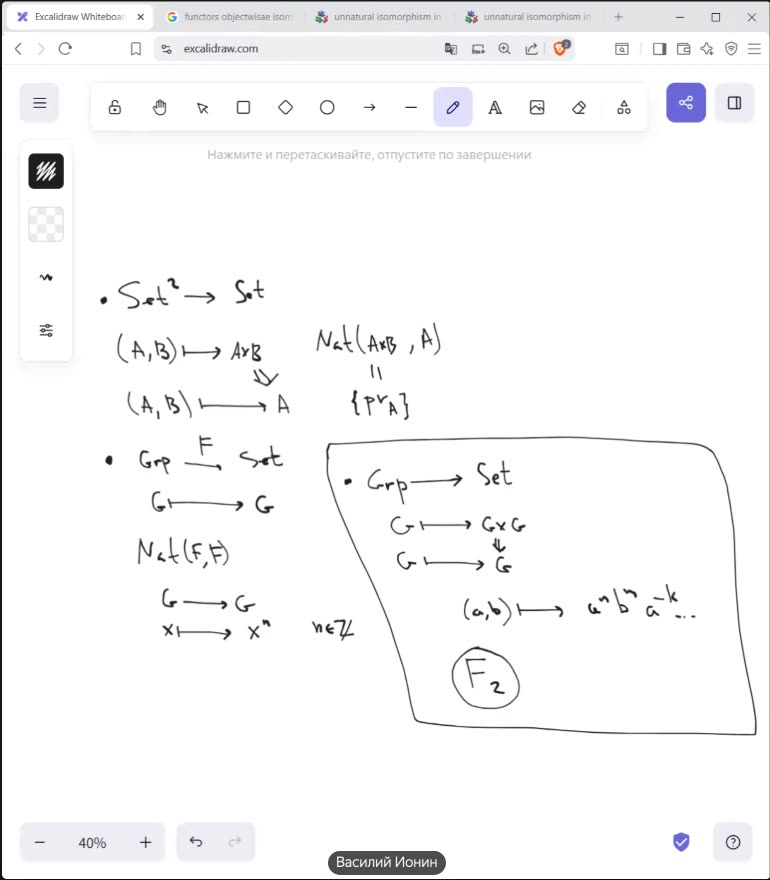
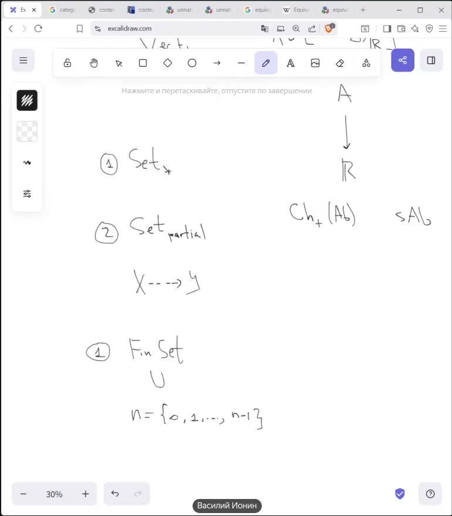
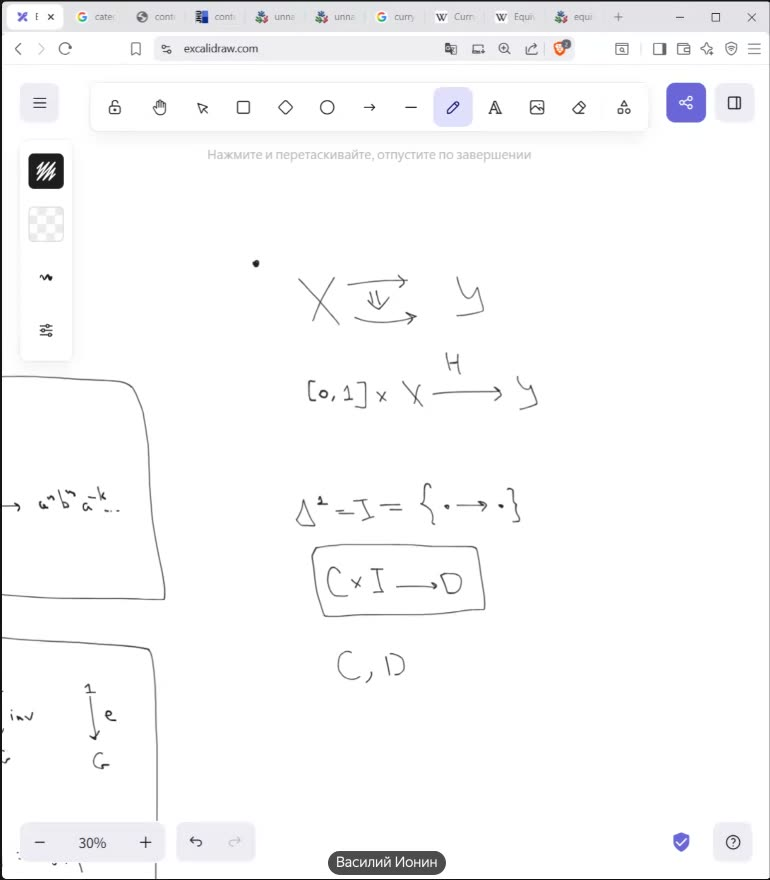
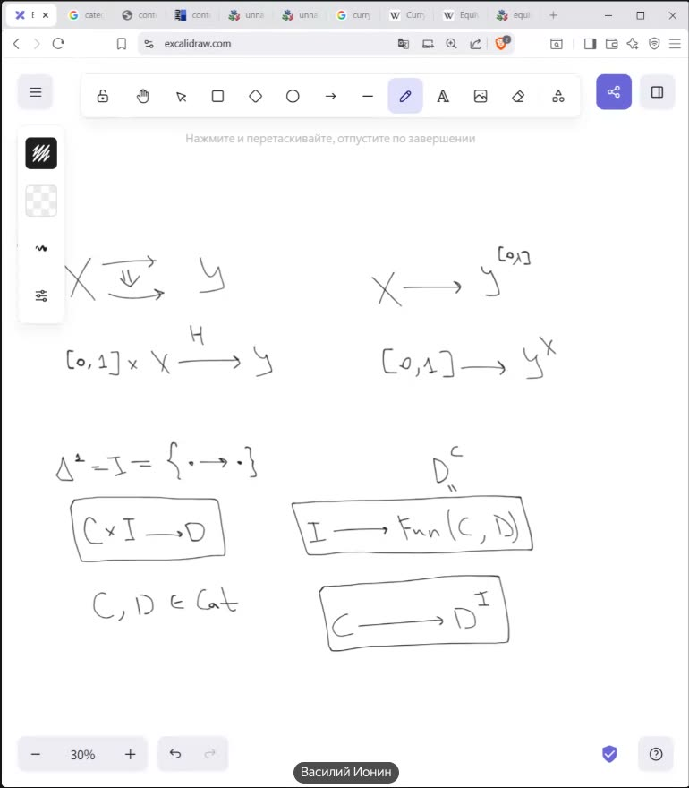
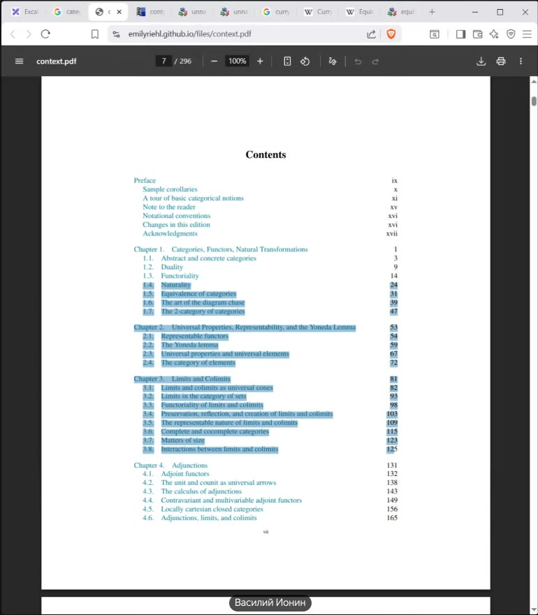
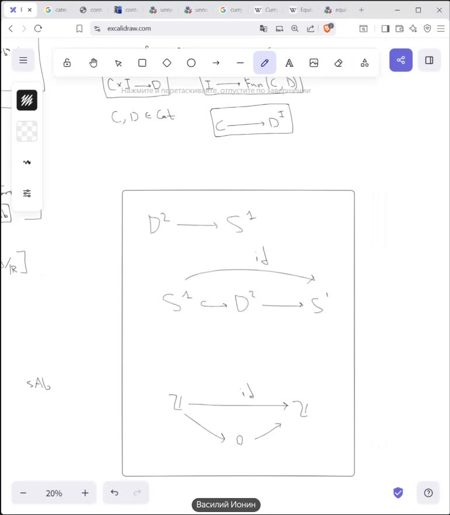
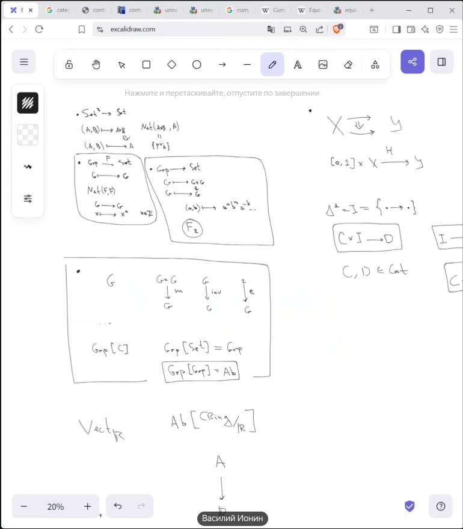

# Встреча 22.07.2026 — консультация по курсу теории категорий

**Участники:** Ваня Яковлев ↔ Василий Ионин (Телемост, 37 мин, запись с 21:05).
**Формат:** Василий демонстрирует экран — доска Excalidraw, местами PDF Э. Риль «Category Theory in Context», nLab и Wikipedia.
**Контекст** (по записи + `teorkat-vvedenie/SPEKA.md`): Ваня готовит «Введение в теорию категорий» — заказную подводку из **трёх лекций (~6 часов)** при курсе по теории типов; потолок — декартово замкнутые категории, финал — Карри–Ховард–Ламбек. Зал — стык ФП и математики (сильные студенты + взрослые с техническим бэкграундом): линал и группы знают, логику вероятно, топологию — не все. **Василий — второй лектор курса**: после подводки Вани глубокую часть читает он, так что встреча — не только консультация, но и согласование стыка между частями. Запись включена уже по ходу встречи (не с начала) — первый пример к её старту на доске уже разобран.

> Таймкоды — от начала записи. Транскрипт — объединение трёх прогонов MacWhisper (Large-v3, диаризация); термины восстановлены по контексту и доске, спорные фрагменты дополнительно перераспознаны локально (mlx-whisper large-v3-turbo) и разрешены.

---

## Выжимка

**О чём говорили.** Разбор «золотых» примеров для первых лекций: естественные преобразования (через $\mathbb{Z}$ и $F_2$), групповые объекты ($Grp[Grp]=Ab$), эквивалентности категорий ($Set_* \simeq Set_{\mathrm{partial}}$, скелет $FinSet$), аналогия «гомотопия ↔ естественное преобразование», доказательство «нет ретракции $D^2 \to S^1$» через функториальность, представимые функторы как мотивация Йонеды. Плюс методика: что давать упражнениями, докуда идти по Риль.

**Договорённости и решения:**
1. **Василий прочитает лекцию про сопряжённые функторы** (для декартовой замкнутости они нужны) — предложил сам, Ваня согласился (≈24:40). Тут же проговорено определение: ДЗК = любой объект экспоненцируем, т.е. функтор умножения на любой объект имеет правый сопряжённый (24:46–25:08).
2. **Объём материала = Риль §1.4–§3.8** (естественность → Йонеда/универсальность → пределы-копределы): на оглавлении PDF Василий явно выделил этот диапазон (25:44). Глава 4 (сопряжения) — поверх, отдельной лекцией.
3. **Лемму Йонеды при первом проходе пропустить**: сначала пределы/копределы для интуиции, иначе Йонеда «слишком абстрактна и непонятно, как связана с реальным миром» (26:27).
4. **Эквивалентность категорий обязательна с первых лекций** — она нужна уже для самой формулировки Карри–Ховарда–Ламбека (10:15, 19:26–20:16).
5. **Ване:** уточнить, что реально знают слушатели (линал ✓, группы ✓, логика — вероятно; топология — нет) и докуда реально идти; возможен запасной «арифметический» вход — аналогия сложение/умножение/степень ↔ копроизведение/произведение/экспонента (31:22–32:56); допустимо закончить раньше ДЗК.
6. **Ване — погуглить аналогии «алгебра ↔ логика»**: Василий предложил сам сюжет, но логику знает мало («можно погуглить, поискать»); Ваня: «да, это я буду гуглить» (31:47–32:02).
7. **Учебник курса — Riehl, «Category Theory in Context»**: «основной учебник сейчас», много поучительных упражнений (4:59–6:30).
8. **Методика упражнений:** рассказывать сюжеты; упражнение должно быть «сильным шагом вперёд» (удивлять — как $F_2$ в задаче про $Nat$), а не проверкой определения (4:20).

**Банк сюжетов для курса, собранный за встречу** (первые четыре — из незаписанной части, §0):
- Категорификация арифметики по Баэзу: ℕ ⇝ FinSet, «законы арифметики становятся естественными изоморфизмами»; упражнение-конфета «деление на 3» (Конвей–Дойл).
- Неестественные изоморфизмы (MO-пост): Sym vs Ord ($n! = n!$, а естественно нельзя), $A \cong T(A)\oplus A/T(A)$, универсальные коэффициенты.
- Нефункториальные конструкции: центр $Z(G)$ — не функтор; границы понятия через контрпримеры.
- Тонкость $V \cong V^*$: не пример неестественности (нет пары параллельных функторов) — а вот $V \cong V^{**}$ естественен.
- $Nat(F,F)\cong\mathbb{Z}$ для забывающего $Grp\to Set$; $Nat(G\times G, G)\cong F_2$ — «естественных преобразований столько же, сколько слов в свободной группе».
- Групповые объекты: $Grp[Set]=Grp$ (интерпретация), $Grp[Grp]=Ab$ (упражнение «надо подумать», Экман–Хилтон), группы Ли = $Grp[\text{гладкие многообразия}]$.
- Изоморфизм категорий: три определения топологического пространства (открытые/замкнутые/оператор замыкания) — категории изоморфны; «„эквивалентные определения“ получает точный смысл».
- Эквивалентности: $Set_* \simeq Set_{\mathrm{partial}}$ («неопределённое отправляем в отмеченную точку»); скелет: $FinSet \simeq \{n=\{0,\dots,n-1\}\}$; критерий fully faithful + essentially surjective — «основная теорема теории категорий».
- Гомотопия ↔ естественность: $H\colon[0,1]\times X\to Y$ против $C\times I\to D$, где $I=\Delta^1=\{\bullet\to\bullet\}$; каррирование $[0,1]\to Y^X$ против $I\to Fun(C,D)=D^C$.
- Нет ретракции $D^2\to S^1$: применяем $\pi_1$ (или $H_1$), получаем $id_{\mathbb{Z}}$ через $0$ — противоречие; «естественность редуцирует вопросы из пространств в группы, где всё видно».
- Представимость: $TM$ и инфинитезимальные объекты, $\pi_1 = [S^1,-]_*$ — «функториальная перспектива мотивирует расширять категории» (спойлер к Йонеде).

---

## Хронологический конспект

### 0. До записи — мотивация естественности (восстановлено со слов Вани, 23.07)

Запись включена посреди встречи; до неё обсуждали **как мотивировать естественное преобразование** — по словам Вани, «самая важная мотивация» для начала курса. Что из этого известно:

- **Василий посоветовал текст Баэза** — рукописные слайды «Euler Characteristic versus Homotopy Cardinality» (2003): «самое начало можно использовать». Начало (стр. 1–4) — категорификация арифметики: ℕ ⇝ FinSet (сложение = копроизведение, умножение = произведение, 0/1 = начальный/терминальный объекты) и тезис **«законы арифметики становятся естественными изоморфизмами»** ($A\times(B+C)\cong A\times B + A\times C$); плюс жемчужина-упражнение **«деление на 3»** (из $3\times A \cong 3\times B$ построить $A\cong B$; Бернштейн 1901 → Линденбаум–Тарский 1927 → Конвей–Дойл 1989). Прямая синергия с «арифметическим» сюжетом Вани из записи (31:22). *Положен в библиотеку: `teoriya-kategoriy/istochniki/pdf/baez-euler-characteristic-vs-homotopy-cardinality.pdf`, дайджест в `VYCHITANO.md` (id `baez-euler`).*
- **Василий дал пост MathOverflow** [«Example of an unnatural isomorphism»](https://mathoverflow.net/questions/139388/example-of-an-unnatural-isomorphism) — примеры *поточечно* изоморфных, но не естественно изоморфных функторов. Топ-ответы: **Sym vs Ord** на группоиде конечных множеств (перестановки и линейные порядки: оба по $n!$ элементов, естественного изоморфизма нет — топ, 72↑); **теорема об универсальных коэффициентах** ($H^n(X;G)$ и $\mathrm{Ext}\oplus\mathrm{Hom}$ изоморфны ненатурально, Хэтчер §3.1, 63↑); **структурная теорема** ($A \cong T(A)\oplus A/T(A)$ поточечно, но не естественно, 8↑); $G$-множества одной мощности, не изоморфные как $G$-множества (19↑); барицентрическое подразделение (21↑).
- **Замечание Василия про $V$ и $V^*$**: как пример «неестественного изоморфизма» он не годится — дуализация контравариантна, это даже не пара функторов в одну категорию, квадрат естественности не написать. (Это же замечание стоит прямо в тексте MO-вопроса; а ответ на 30↑ показывает, как пример спасти: взять группоид конечномерных пространств и два функтора $C \to C^{op}$ — дуализацию и каноническую эквивалентность.) Ваня: «думаю, это не так страшно — надо подумать».
- **Отдельный тезис Василия: бывают конструкции, которые вообще не функторы** — например, **переход к центру группы** $G \mapsto Z(G)$ нефункториален. Обсудить «нефункториальные штуки» на курсе — важная вещь (граница понятия видна по контрпримерам).

*Следы этого обсуждения видны в записи: в браузере Василия с первого кадра висят вкладки «unnatural isomorphism in…» ×2 и «functors objectwise isom…».*

### 1. Примеры естественных преобразований (0:00–3:45)

Запись начинается посреди первого примера. На доске уже: $Set^2\to Set$, $(A,B)\mapsto A\times B$ и $(A,B)\mapsto A$.

- **В:** «Оказывается, все естественные преобразования — это в точности проекция»: $Nat(A\times B,\ A)\cong\{pr_A\}$ (доска 0:30).
- **Пример 2** (0:35–1:55): забывающий функтор $F\colon Grp\to Set$, $G\mapsto G$. Что такое $Nat(F,F)$? «Беру элемент $x$ — куда его отправить? Вариантов немного: $x\mapsto x^n$, $n\in\mathbb{Z}$. Это не гомоморфизм, но и не нужно — мы в множествах. Ничего другого в произвольной группе не запишешь». Доска: $Nat(F,F)$, $G\to G$, $x\mapsto x^n$, $n\in\mathbb{Z}$.
- **В** о методике: «Часто просто видишь два функтора — и сразу понимаешь все естественные преобразования между ними. Хочется донести, что это простая вещь».
- **Пример 3** (2:03–3:44): $Grp\to Set$, $G\mapsto G\times G$ против $G\mapsto G$ («лучше снова в множества, чтобы поинтереснее»). Компонента — любое групповое слово: $(a,b)\mapsto a^n b^n a^{-k}\cdots$. «Любое слово задаёт естественное преобразование ⇒ их столько же, сколько слов в свободной группе ранга 2» — на доске кружок $F_2$. «В прошлом примере $\mathbb{Z}$ — это свободная группа ранга 1. Не совпадение».
- **В** о раздаче (3:47): первое — показать самому, про $\mathbb{Z}$ — тоже, а $F_2$ — упражнение, «чуть посложнее».

### 2. Листочки, упражнения и учебник Риль (4:02–7:13)

- **Я** (4:02): упражнений много, «вопрос, можно ли составить листочек — и будут ли они это делать».
- **В** (4:20): рассказывать сюжеты; упражнения должны давать «сильный шаг вперёд»: «ничего себе, свободная группа ранга 2!»
- **Я** (4:38): «Знаешь хорошие листочки для первого знакомства с категориями?» — **В**: «Листочков, честно, не знаю. Знаю книжки. Основной учебник сейчас — *Category Theory in Context*» (Риль).
- **Я**: «Скачан, но пока не прочувствовал». Вместе открывают PDF (5:32, emilyriehl.github.io → зеркало math.jhu.edu), поиск по слову *exercise* — 173 совпадения. Листают: Ex. 1.1.1–1.1.2 (единственность обратного, группоид изоморфизмов), затем Ex. 1.4.1–1.4.4 — **Ex. 1.4.2 «What is a natural transformation between a parallel pair of functors between groups?» дословно совпадает с только что разобранным на доске**; дальше Ex. 1.5.1–1.5.7 (эквивалентности). По ходу **В** отмечает: «Example 1.3.13 — это любимое упражнение Питера Мэя, про расширение Галуа».
- **Я** (6:44): хочется *содержательных* упражнений, не проверок определений; «расстраивает, что тексты по теории категорий часто такие».

### 3. Групповые объекты (7:14–9:00)

![Групповой объект и Grp[Grp]=Ab](кадры/02-групповой-объект.jpg)

- **В**: «Можно такой прикол дать: определение группы чисто категорно». Доска (7:22–7:40): $G\times G\xrightarrow{m}G$, $G\xrightarrow{inv}G$, $1\xrightarrow{e}G$ — умножение, обращение, выбор единицы из терминального объекта; аксиомы кодируются диаграммами.
- «Если в категории $C$ есть все произведения — можно рассматривать групповые объекты $Grp[C]$»: $Grp[Set]=Grp$ прямо по определению; **упражнение: $Grp[Grp]=Ab$** — «это надо подумать, почему» (доска: ответ в рамке, 8:24). Группы в гладких многообразиях — группы Ли, «но это не упражнение, это интерпретация определения».
- **Я**: «Знают ли они группы Ли? Скорее всего нет». … «Это классно, я помню».

### 4. Программа первых лекций и запрос курса (8:53–10:35)

- **В** (8:53): на первых лекциях главное — определение категории, морфизмы (моно/эпи), «как переписывать вещи категорно, без апелляции к элементам», диаграммы, функтор, естественное преобразование, примеры. «Если это рассказать — уже очень хорошо».
- **Я** (9:27): есть теорема, связывающая декартово замкнутые категории и типизированные λ-исчисления — **Карри–Ховард–Ламбек**; «один из вариантов — попробовать дойти до неё, условно, за три занятия. Что думаешь?» (на экране мелькает поиск «curry howard lambek», 10:02).
- **В** (10:15): «Тогда вам нужна **эквивалентность категорий** — прямо на первых лекциях: функтор, естественное преобразование, эквивалентность».

### 5. Зоопарк эквивалентностей: что сложно, что доступно (10:38–15:20)

![Vect_R, Ab[CRing/R], Дольд–Кан](кадры/03-примеры-категорий.jpg)

**В** перебирает известные ему эквивалентности с оценкой «подъёмности» (10:57–13:20):
- Локально компактные абелевы группы — двойственность **Понтрягина**: «пропускаем, сложно» (нужна топология).
- Конечные множества / **пространства Стоуна** / булевы алгебры: «сложно». **Я** вспоминаю соответствие из книжки Вербицкого; **В**: «там три штуки: конечные множества, вполне несвязные компактные [стоуновские] пространства и булевы алгебры» — «в этом и прикол: такая двойственность между алгеброй и геометрией». Дальше перечислением: **двойственность Гельфанда, двойственность Серра–Суона, двойственность Габриэля–Ульмера, пучки на пространстве**.
- $R$-модули / $Vect_{\mathbb{R}}$ («можно взять векторные пространства над полем, считать что $\mathbb{R}$») ≃ **абелевы объекты в slice-категории** $CRing/\mathbb{R}$ — аугментированные алгебры $A\to\mathbb{R}$: «забавная, но, подумал сейчас, сложная» (доска 12:14–12:42: $Vect_R$, $Ab[CRing/R]$, диаграмма $A\to R$).
- **Дольда–Кана**: $Ch_+(Ab)\simeq sAb$ — «им нужно бы рассказать, в целом полезно, там всё симплициальное… но доказывать — заколебёшься» (доска 13:10–13:36).

**Изоморфизм категорий как первый шаг** (13:25–14:30): «Когда школьникам рассказывал про эквивалентность, я начинал с *изоморфизма* категорий»: три определения топологического пространства — через открытые множества, через замкнутые, через оператор замыкания ($f(\overline{A})\subseteq\overline{f(A)}$) — дают изоморфные категории. «В разных курсах говорят: „эти определения эквивалентны“. А тут есть конкретная трактовка, что это значит».

### 6. $Set_*\simeq Set_{\mathrm{partial}}$ и скелет (15:22–18:10)

- **В** (15:22): «прикольный пример»: категория **множеств с отмеченной точкой** (морфизмы сохраняют точку) и категория **множеств с частично определёнными отображениями** ($X\dashrightarrow Y$; «морфизм — подмножество в $X$ и стрелка на нём»). «Эти категории эквивалентны». **Я**: «Непонятно звучит — нетривиально, интересно!.. А, понял: там, где отображение не определено, отправляем в отмеченную точку. Класс, это красиво».
- Попутно (16:18–16:36) на экране nLab и Wikipedia «Equivalence of categories»; в Википедии выделена строка **«Any category is equivalent to its skeleton»**.
- **Скелет** (16:28–17:30): пример с $FinSet$ — взять по конкретному представителю: $\{\,n=\{0,1,\dots,n-1\}\mid n\ge 0\,\}$, «включение — эквивалентность категорий». **Я**: «по одному объекту из каждого класса изоморфизма, породить полную подкатегорию». **В**: да, это эквивалентность.
- **В** (17:28): «Говорят, *основная теорема теории категорий* — критерий эквивалентности: функтор fully faithful + существенно сюръективный ⇒ эквивалентность». **Я**: «то есть биекция на классах изоморфизма объектов, правильно согласованная со всем остальным — „пространства модулей объектов одинаковые“».

### 7. Зачем эквивалентность нужна Карри–Ховарду (18:11–20:27)

- **Я** (18:11): хочется теорему «не про категории, а про что-то, что люди понимают: со сложной, некрасиво запакованной формулировкой, которая потом упаковывается в одну фразу — *такие-то две категории эквивалентны*».
- **Я** (19:26–20:16, на экране Wikipedia «Curry–Howard correspondence»): есть **просто типизированное λ-исчисление** и **декартово замкнутые категории**; по категории строится исчисление, по исчислению — категория. Стартуешь с исчисления — возвращаешься к нему же; стартуешь с категории — получаешь *эквивалентную* категорию. «Чтобы это было „биекцией“ в кавычках, всё нужно рассматривать с точностью до эквивалентности — уже для формулировки».
- **В**: «Я не понял — это Ламбека теорема прямо?» — **Я**: «Насколько можно сказать, да; не категорная теорема, а теорема, для которой нужно понимать этот язык».

### 8. Гомотопия ↔ естественное преобразование (20:28–24:27)

- **В** (20:28): «Ещё можно пространственные интуиции продвигать — не формализм, а пояснить: есть топологические пространства, есть **гомотопия** между отображениями. И она *точно похожа* на естественное преобразование. Это можно формализовать».
- Доска (20:44–21:56): $X\rightrightarrows Y$; $H\colon[0,1]\times X\to Y$; **интервальная категория** $\Delta^1=I=\{\bullet\to\bullet\}$ («два объекта и одна стрелка, ну ещё $id$-шки»); в рамке $C\times I\to D$, подпись $C,D\in Cat$. «Гомотопия [категорная] — это просто функтор из $C\times I$ в $D$. Естественное преобразование — тоже типа гомотопия».
- **Я** (21:47): «Что такое $C$ и $D$? — Любые категории. — А, всё, я всё понял». **В**: «Естественное преобразование — не новое определение, а частный случай функтора» (с такой сигнатурой).
- **Каррирование** (22:12–23:44): «Когда доберёмся до декартово замкнутых: гомотопию можно воспринимать как непрерывное отображение $[0,1]\to Y^X$ — путь в пространстве отображений». Доска зеркалит: $I\to Fun(C,D)=D^C$ и $C\to D^I$ (см. кадр 06). **В** (22:49): «Небольшое лукавство: чтобы определить функторную категорию, мне уже нужно естественное преобразование — морфизм в этой категории». — **Я** (22:58): «Но его можно, наверное, определить — ну, типа, как $D^I$». Итог (23:26): «Такой **калькулус декартово замкнутых категорий** — через него можно мыслить естественные преобразования; часто один из взглядов удобнее других. В теории категорий много работы „проверять, что диаграммы коммутируют, и держать всё в голове“ — проще считать, что есть просто одно понятие функтора».

- **В** (24:04): зачем это всё: «потом захотим доказать, что композиция естественных преобразований — естественное преобразование. Мы уже знаем: композиция функторов — функтор, и этим пользуемся. **Эти машины нужны, чтобы автоматизировать наш reasoning**».
- **В** (24:28): «Да, для декартово [замкнутых] нужно сопряжение. Если можно — **я могу прочитать лекцию про сопряжённые функторы**». — **Я**: «Да, конечно». ✅
- Следом (24:46–25:08) проговаривают определение. **Я**: «Для декартово замкнутых нужно сопряжение — дадим определение…» — **В**: «Любой объект экспоненцируем: функтор умножения на любой объект имеет правый сопряжённый». — **Я**: «А, ну хорошо, понятно».

### 9. Докуда идти по Риль (25:16–26:44)

- **Я**: «Тогда мне нужно понять, чего рассказывать — с какого места до какого».
- **В** (25:36, на экране оглавление context.pdf; выделяет диапазон **§1.4 Naturality → §3.8**, конец главы о пределах): «Вот Эмили Риль: четвёртая глава — сопряжения. Всё, что до неё, можно рассказать на первых паре лекций, по топикам».
- **Я** (25:51): «А лемма Йонеды нужна вначале?.. Нет-нет, это просто вопрос — я сейчас думаю, как это всё рассказывать» (26:05). — **В** (26:27): «**Я бы пропустил лемму Йонеды при первом проходе.** Сначала пределы — чтобы появилась интуиция. Иначе Йонеда выглядит очень абстрактно и непонятно, как связана с реальным миром». ✅

### 10. «Входы» из смежных областей; $D^2\to S^1$ (26:45–31:20)

- **Я** (26:45): «Хочется рассказывать вещи, максимально связанные с сюжетами за пределами теории категорий. Знаешь хорошие входы из смежных областей?» (Перед этим на экране мелькает Риль стр. 97 — естественные эндоморфизмы забывающего $Ring\to Set$ = целочисленные многочлены $\mathbb{Z}[x]$ — ещё один пример в ту же копилку.)
- **Я** (27:12): «…входы из смежных разделов, которые что-то *мотивируют*». — **В** (27:20): «Ну так ведь Эйленберг и Маклейн придумали теорию категорий, потому что аргументы естественности очень много что помогали решать в теории гомотопий, в алгебраической топологии» — теорема Брауна о представимости когомологий, аксиомы Эйленберга–Стинрода; «классический пример как раз приводят: почему не существует ретракции из диска на ограничивающую его окружность» →
- **В** — коронный пример (27:44–29:04, доска): предположим, есть ретракция $D^2\to S^1$, т.е. $S^1\hookrightarrow D^2\to S^1 = id$. «Берём любой разумный функтор на категории пространств — $\pi_1$ или $H_1$: получается, что $\mathbb{Z}\xrightarrow{id}\mathbb{Z}$ пропускается через $0$. Противоречие». Блок обведён двойной рамкой.
- Мораль (28:13): «Соображение естественности такое мощное, что позволяет редуцировать вопросы из пространств в группы, где всё сильно проще. Почему окружность не ретракт диска — непонятно; почему $\mathbb{Z}$ не ретракт $0$ — понятно. Отображаемся в более простую категорию, оставляем простые свойства — и на них всё видно». «Где такие же примеры в областях попроще — в логике? — честно, не знаю. А вот это — хороший пример».
- **Я** (28:58): можно рассказать даже программистам; замысел площадки: кто не знает топологию — довести до декартово замкнутых категорий, «чтобы дальше слушали курс по теории типов».
- **В** (29:31): не обязательно ни рассказывать всю топологию, ни делать вид, что все её знают: «сказать — людей интересуют пространства: вот диск, вот окружность, почему нельзя сплющить диск на окружность непрерывно, без разрыва? Задача всем понятна. И вот так элегантно решается». «Естественность используется много где, но *простых* примеров я прям не знаю».
- **Я** (30:39): «Надо понять, чего люди знают: линал знают, определение группы знают… логику, наверное, знают». (31:22) Запасной сюжет: аналогия с арифметикой — как соотносятся сложение, умножение, возведение в степень, $0$, $1$ [и их категорные аналоги: копроизведение, произведение, экспонента, начальный и терминальный объекты] — «достаточно простая вещь, которую я бы мог рассказать. В принципе, могу и раньше закончить».
- Про аналогии «алгебра ↔ логика» **В** честно (31:47): «Может, что-то такое прикольное и есть — я просто не очень знаю логику. Можно погуглить, поискать». — **Я**: «Да-да, это я буду гуглить». ✅

### 11. Представимые функторы — мотивация Йонеды (33:26–36:10)

![TM, Hom(→,−), [S¹,−]*](кадры/09-представимость-pi1.jpg)

- **В** (33:01): «Можно ещё рассказывать про представимые функторы. Это **самый важный пример функторов**: для любого объекта есть ковариантный hom и контравариантный hom. Объяснить, как они работают — очень интуитивная вещь для людей. И перед леммой Йонеды это очень полезно».
- (33:26) «Есть такая идеология — *пробовать* объекты другими. Кстати, про анализ: люди изучают касательное пространство многообразия. Что это такое? Точка на многообразии и касательный вектор в касательной плоскости…»
- (33:52) «Представим на секунду, что у нас было бы многообразие, которое ведёт себя как **инфинитезимальный отрезок**. Если бы такое многообразие было, касательное пространство — это просто hom из этого инфинитезимального отрезка в $M$: отобразиться из инфинитезимального отрезка — как раз выбрать точку и вектор. Получается соответствие $M \mapsto TM$». Доска (33:12–34:28): $TM$; $M\to TM$; пиктограмма-«стрелка» $\{\bullet\to\}$ (инфинитезимальный отрезок) и $Hom(\to, M)$.
- (34:39) «Если нас интересует гладкий анализ — разумно добавлять инфинитезимальные пространства как *актуальные объекты*, чтобы больше функторов было представимыми. С представимыми проще работать: мы понимаем, как устроены естественные преобразования между ними — **спойлер: лемма Йонеды**».
- (35:00) «Представимый ковариантный функтор переводит пределы в пределы; контравариантный — копределы в пределы. Они хорошо взаимодействуют с внутрикатегорными конструкциями — поэтому интересно расширять категории, добавляя представляющие объекты. **Фундаментальная группа, которую мы выше обсуждали, — это просто $Hom$ из окружности** — в правильной категории, где стрелки — гомотопические классы пунктированных отображений» (доска: $Hom(\to,-)$, $[S^1,-]_*$).
- **Я** (35:45): «Понятно: функториальная перспектива мотивирует расширять категории, добавлять больше объектов».

### 12. Финал (36:00–37:10)

Демонстрация экрана выключается в 36:44; короткое устное завершение: «Вроде всё понятно, спасибо. Супер. Ладно, всё, пока, удачи».

---

## Реконструкция доски (итоговое состояние)

Шесть блоков, в порядке появления:

**Блок 1 — естественные преобразования (0:00–3:44)**
- $\bullet\ Set^2\to Set$: $(A,B)\mapsto A\times B$ ⇓ $(A,B)\mapsto A$; итог: $Nat(A\times B, A)\cong\{pr_A\}$
- $\bullet\ Grp\xrightarrow{F} Set$, $G\mapsto G$; $Nat(F,F)$: компоненты $G\to G$, $x\mapsto x^n$, $n\in\mathbb{Z}$ (в рамке)
- $\bullet\ Grp\to Set$: $G\mapsto G\times G$ ⇓ $G\mapsto G$, компонента $(a,b)\mapsto a^n b^n a^{-k}\cdots$; ответ: свободная группа — в кружке $F_2$ (в рамке)

**Блок 2 — групповой объект (7:22–8:24)**
- $G\times G\xrightarrow{m}G$, $\ G\xrightarrow{inv}G$, $\ 1\xrightarrow{e}G$; обозначение $Grp[C]$
- $Grp[Set]=Grp$; **$Grp[Grp]=Ab$** (в рамке); весь блок обведён

**Блок 3 — примеры категорий и эквивалентностей (12:14–16:56)**
- $Vect_R$, $Ab[CRing/R]$ с диаграммой $A\to R$ (slice-категория, аугментированные алгебры)
- $Ch_+(Ab)$, $sAb$ (пара Дольда–Кана)
- ① $Set_*$ ② $Set_{\mathrm{partial}}$ с $X\dashrightarrow Y$ (эквивалентные категории)
- ① $FinSet$ и его скелет $\{\,n=\{0,1,\dots,n-1\}\mid n\ge 0\,\}$

**Блок 4 — гомотопия ↔ естественность (20:44–23:44)**
- $X\rightrightarrows Y$, $H\colon[0,1]\times X\to Y$, каррированная форма $[0,1]\to Y^X$, пометка $Y^{[0,1]}$
- $\Delta^1=I=\{\bullet\to\bullet\}$; в рамках: $C\times I\to D$, $I\to Fun(C,D)=D^C$, $C\to D^I$; $C,D\in Cat$

**Блок 5 — нет ретракции $D^2\to S^1$ (27:44–29:04)**
- $D^2\to S^1$; $S^1\hookrightarrow D^2\to S^1$ с дугой $id$
- $\mathbb{Z}\xrightarrow{id}\mathbb{Z}$ и факторизация $\mathbb{Z}\to 0\to\mathbb{Z}$ — противоречие; блок в двойной рамке

**Блок 6 — представимость (33:12–35:32)**
- $TM$, $M\to TM$, пиктограмма инфинитезимального отрезка $\{\bullet\to\}$: если бы такое «многообразие» существовало, $TM = Hom(\{\bullet\to\},\, M)$ — выбор точки и вектора
- $Hom(\to, M)$ → обобщение $Hom(\to, -)$ → $[S^1, -]_*$ ($\pi_1$ как представимый функтор)

---

## Связка с проектом (`teorkat-vvedenie`)

Как встреча ложится на открытые вопросы и рамку проекта (сама папка не менялась — это только сопоставление):

- **Открытый вопрос №1 SPEKA (точка передачи Ваня → Василий)** обретает форму: граница проходит по сопряжениям (гл. 4 Риль) — подводка Вани идёт до них, и Василий сам предложил прочитать лекцию про сопряжённые функторы как мост к своей части.
- **Открытый вопрос №4 SPEKA (откуда брать упражнения)** получает кандидата: упражнения Риль (173 в книге; на встрече одобрены как «поучительные») + конкретные упражнения Василия ($Nat \cong F_2$ — «сильный шаг вперёд», $Grp[Grp]=Ab$).
- **Прайор SPEKA §Охват** («начинать с функторов и естественных преобразований») Василий независимо подтвердил: «на первых лекциях прямо — функтор, естественное преобразование, эквивалентность категорий»; это же согласуется с гипотезой начала в `KOTYOL` («что такое естественная конструкция» раньше формального определения категории).
- **Сюжет «нет ретракции $D^2\to S^1$»** проходит гейт котла по всем трём ситам: приз чужой (вопрос про пространства, К1 — «задача всем понятна»), прок «доказать коротко», несёт понятия минимума (функтор + естественность); Василий подал его и как ответ на «почему Эйленберг и Маклейн вообще это придумали».
- **Дух Т1** (герой курса — конкретное совпадение КХЛ): встреча уточнила, зачем в формулировке КХЛ нужна эквивалентность категорий — «из категории возвращается эквивалентная, не та же» — то есть эквивалентность обязана войти в язык подводки.

## Материалы с экрана и рекомендации

- **John Baez, «Euler Characteristic versus Homotopy Cardinality»** (рукописные слайды, 2003) — рекомендация Василия из незаписанной части (§0): начало — под мотивацию естественности; положен в `teoriya-kategoriy/istochniki/pdf/baez-euler-characteristic-vs-homotopy-cardinality.pdf` (дайджест: `VYCHITANO.md`, id `baez-euler`).
- **MathOverflow: [Example of an unnatural isomorphism](https://mathoverflow.net/questions/139388/example-of-an-unnatural-isomorphism)** — рекомендация Василия (§0): банк поточечно-но-не-естественно изоморфных функторов.
- **Emily Riehl, «Category Theory in Context»** — emilyriehl.github.io/files/context.pdf (открывалось также зеркало math.jhu.edu). Рабочий диапазон курса: §1.4–§3.8; упражнения 1.1.1–1.1.2, 1.4.1–1.4.4 (особенно **1.4.2** — дословно пример с доски), 1.5.1–1.5.7; стр. 97: $Nat(U,U)\cong\mathbb{Z}[x]$ для $U\colon Ring\to Set$, дискретные расслоения (Def 2.4.13).
- **nLab**: «equivalence of categories».
- **Wikipedia**: «Equivalence of categories» (выделено: «Any category is equivalent to its skeleton»; примеры двойственностей Стоуна, Гельфанда, Биркгофа), «Curry–Howard correspondence» (de Bruijn, BHK, реализуемость).
- Упомянута книжка Вербицкого (соответствие Стоуна: конечные множества / стоуновские пространства / булевы алгебры).

## Файлы

- `конспект.md` — этот документ
- `кадры/` — 10 ключевых кадров доски; `кадры-все/` — все 154 уникальных состояния доски (имя файла: `u_НОМЕР_tСЕКУНДЫs.jpg`)
- Полные транскрипты — три прогона MacWhisper в `~/Downloads`: «Встреча 22.07.26 — аудио.txt/.srt» (v1), «Встреча 22.07.26 .txt / 22.07.26.srt» (v2), «Встреча 22.07.26 — 3.txt/.srt» (v3, лучшая диаризация). Прогоны дополняют друг друга: v2 единственная услышала 23:26–25:08, 27:12–27:37, 31:47–32:02, 33:01–34:18; v3 уточнила атрибуции реплик. Конспект сшит по объединению всех версий; спорные имена (Питер Мэй, Серр–Суон, Габриэль–Ульмер, теорема Брауна) перераспознаны локально по вырезкам аудио (mlx-whisper large-v3-turbo).
