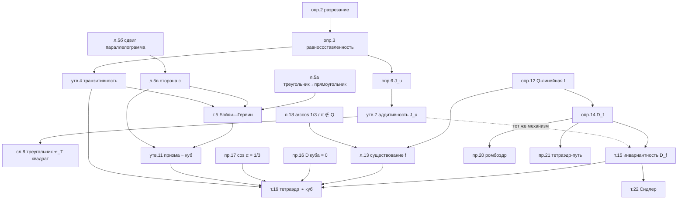

# PLAN — рассказ «Третья проблема Гильберта» по блокам

> Порядок рассказа. Строгие формулировки и доказательства — `SKELET.md` (номера в скобках), находки и
> источники — `KARTOCHKI.md`. Формулировки здесь пишутся полностью (закон полноты); доказательства — ходами.
> У каждого блока: **цель** (что изменится в голове слушателя) · **вход** (на что опирается) · **формулировки** ·
> **ходы** (вопрос залу → ожидаемый ответ) · **🖼** · **ловушка**.

**Throughline.** Чтобы доказать, что чего-то сделать нельзя, нужна величина, которая не меняется при
разрешённых действиях; на плоскости её нет (кроме площади), в пространстве она есть — инвариант Дена, и
изобретается он из одного наблюдения: внутренний разрез считается дважды и сокращается.

**Ход в целом.** 2D «да» → 2D без поворотов «нет» (тренажёр инварианта) → [перерыв] → 3D «призмы да, пирамиды?»
→ инвариант Дена → счёт → проверки → куда дальше.

---

## Б0 · Вопрос

- **Цель:** поставить задачу точно, так, чтобы «нельзя» стало осмысленным утверждением.
- **Вход:** ничего.
- **Формулировки.**
  - *Разрезание* $P=P_1\cup\dots\cup P_n$: куски — многоугольники (многогранники), внутренности попарно не пересекаются. (опр. 2)
  - $P\sim Q$ (*равносоставлены*), если $P$ и $Q$ разрезаются на куски, попарно переводимые друг в друга движениями. (опр. 3)
  - Вопрос: верно ли, что фигуры равной площади (объёма) равносоставлены?
- **Ходы.** «Квадрат и треугольник одной площади — можно?» → интуиция «да». «Тетраэдр и куб?» → пусть поставят ставки.
  «Что понадобится, чтобы доказать “нельзя”?» → подводим к слову «инвариант», не называя его.
- **🖼** треугольник, разрезанный на 4 куска, и сложенный из них квадрат (пазл Дьюдени — как картинка-приманка).
- **Ловушка:** не дать определению расплыться — куски именно многоугольники, конечное число, движения любые.

## Б1 · Плоскость: всё можно

- **Цель:** ребята сами доказывают теорему Бойяи — Гервина и видят, что вся она держится на одном трюке.
- **Вход:** Б0.
- **Формулировки.**
  - *Транзитивность:* $P\sim Q$, $Q\sim R$ ⇒ $P\sim R$ (утв. 4).
  - *Теорема Уоллеса — Бойяи — Гервина:* многоугольники равной площади равносоставлены (т. 5).
- **Ходы (цепочка вопросов).**
  1. «Как доказать транзитивность?» → наложить два разрезания $Q$.
  2. «Значит, достаточно всё свести к квадрату. С чего начать?» → режем на треугольники.
  3. «Треугольник в прямоугольник?» → средняя линия + два поворота на $180^\circ$ (л. 5а).
  4. «Прямоугольник $a\times b$ в прямоугольник с заданной стороной $c$?» — главный трюк: параллелограмм
     с основанием $a$ и боковой стороной $c$, сдвиг вдоль полосы (л. 5б), потом тот же параллелограмм с
     основанием $c$ (л. 5в). Если $c<b$ — сначала режем пополам и кладём в ряд.
  5. «Собираем» → столбик прямоугольников ширины $c=\sqrt S$.
- **🖼** (а) треугольник → прямоугольник, два поворота стрелками; (б) полоса, замощённая сдвигами $ABCD$, и
  $ABEF$, нарезанный ею; (в) «параллелограмм на двух основаниях»; (г) столбик.
- **Ловушка:** л. 5б при сильно скошенном параллелограмме требует многих кусков — сразу показывать замощение
  полосы, а не «отрезали треугольник, перенесли».

## Б2 · Плоскость без поворотов: первое «нельзя»

- **Цель:** изобрести инвариант там, где всё видно руками; понять механизм «внутренний разрез сокращается».
- **Вход:** Б1 (вопрос «какие движения мы использовали?»).
- **Формулировки.**
  - $P\sim_T Q$: равносоставлены, причём все движения — параллельные переносы (опр. 3).
  - *Инвариант Хадвигера:* для направления $u$ $J_u(P)=\sum\pm\ell(e)$ по сторонам, параллельным $u$; знак $+$, если
    фигура слева от стороны при движении по $u$, и $-$, если справа (опр. 6).
  - $J_u$ аддитивна при разрезании и не меняется при переносе; центральная симметрия меняет знак (утв. 7).
  - *Следствие:* треугольник и квадрат равной площади не равносоставлены переносами (сл. 8).
- **Ходы.** «Где в Б1 мы поворачивали?» → в л. 5а на $180^\circ$ и при укладке столбика на произвольный угол. «А если запретить повороты совсем?»
  → пусть попробуют треугольник → квадрат и застрянут. «Что меняется у куска при разрезе?» → у новой стороны
  два соседа по разные стороны. «Придумайте число, которое это видит» → $J_u$. Финал: у квадрата $J_u\equiv0$,
  у треугольника нет.
- **Сказать вслух (insight):** разрез внутри фигуры появляется дважды — у двух кусков, с противоположных сторон;
  поэтому всё, что считается «со знаком стороны», сокращается. Это ровно тот механизм, который через час сработает у Дена.
- **Формулировка без доказательства:** Хадвигер — Глур: $P\sim_T Q$ ⇔ равны площади и все $J_u$ (т. 9).
  И обратная сторона: переносов и поворотов на $180^\circ$ хватает для теоремы Бойяи — Гервина (т. 5′) — то есть
  ровно повороты на $180^\circ$ незаменимы, и $J_u$ это видит (они меняют знак $J_u$).
- **🖼** треугольник со стрелкой направления $u$ и знаками сторон; квадрат с $+a$/$-a$; внутренний разрез с
  двумя кусками и $+\ell$/$-\ell$.
- **Ловушка:** $J_u$ — функция направления, а не одно число; у треугольника ненулевая на трёх направлениях.

— **перерыв** —

## Б3 · Пространство: что удаётся

- **Цель:** локализовать трудность: не «3D», а пирамиды.
- **Вход:** Б1 (т. 5, л. 5в).
- **Формулировки.**
  - Любая прямая призма равносоставлена кубу того же объёма (утв. 11).
  - *Третья проблема Гильберта (1900):* существуют ли два тетраэдра равного объёма (у Гильберта — с равными
    основаниями и высотами), которые не равносоставлены?
- **Ходы.** «Призма?» → основание в квадрат, брус в куб двумя применениями л. 5в. «Пирамида?» → тупик.
  Единственный исторический анекдот: Гаусс в письме Герлингу жалуется, что объём пирамиды в школе доказывают
  пределами; Гильберт спрашивает, неизбежно ли это; Ден отвечает в том же году — первая решённая проблема списка.
- **🖼** призма → брус → куб (три кадра); пирамида со знаком вопроса.
- **Ловушка:** анекдот — одна минута, не биография.

## Б4 · Изобретаем инвариант Дена

- **Цель:** ребята доходят до $D_f$ сами, со мной в роли подсказчика; главное прозрение лекции.
- **Вход:** Б2 (механизм сокращения), Б3 (вопрос).
- **Ходы.**
  1. «Что у многогранника есть, кроме объёма, что “складывается”?» → рёбра: длина $\ell$ и двугранный угол $\theta$.
  2. Пробуем $\sum\ell\,\theta$. «Откуда при разрезании берутся новые рёбра?» — три случая:
     внутри многогранника (углы кусков в сумме $2\pi$) · внутри грани ($\pi$) · кусок старого ребра ($\theta$).
  3. «Что мешает?» → только кратные $\pi$. «Давайте по модулю $\pi$!» → «а что такое $\ell\cdot\theta\bmod\pi$, если
     $\ell=\sqrt2$?» — не определено: $\ell(\theta+\pi)\not\equiv\ell\theta$.
  4. Фокус: вместо угла подставим $f(\theta)$, где $f$ аддитивна и $f(\pi)=0$.
- **Формулировки.**
  - *$\mathbb Q$-линейная функция* на $V$ (рациональные комбинации конечного набора чисел): $f(x+y)=f(x)+f(y)$,
    $f(qx)=qf(x)$ при $q\in\mathbb Q$ (опр. 12).
  - *Инвариант Дена:* $D_f(P)=\sum_e\ell(e)\,f(\theta(e))$, если все двугранные углы $P$ лежат в $V$ и $f(\pi)=0$ (опр. 14).
  - *Теорема Дена (инвариантность):* равносоставленные многогранники имеют равные $D_f$ при любой такой $f$,
    определённой на углах всех кусков (т. 15).
- **Доказательство ходом:** дробим рёбра на отрезки; для каждого отрезка сумма углов кусков равна $2\pi$, $\pi$ или
  $\theta_P$; $f$ линейна и убивает $\pi$. Отрезки внутри граней куска добавляются с углом $\pi$ — бесплатно.
- **Сказать вслух:** «это Б2, только вместо знака стороны — угол, а вместо $\pm$ — $f(\pi)=0$».
- **Мостик (по времени):** почему на плоскости так не выйдет — у вершины нет длины, и
  $\sum f(\text{углов})=f((n-2)\pi)=0$ (зам. 10).
- **🖼** три типа новых рёбер в разрезе: ребро внутри (пучок кусков, $2\pi$), на грани (полупространство, $\pi$),
  на ребре (клин $\theta$).
- **Ловушка:** не говорить «функция на всех вещественных» — только на конечномерном $V$; иначе всплывает аксиома
  выбора, которой здесь нет.

## Б5 · Считаем: тетраэдр не куб

- **Цель:** довести до конца; одна задача решается на доске залом.
- **Вход:** Б4.
- **Формулировки.**
  - $D_f(\text{куб})=12a\,f(\pi/2)=0$ (пр. 16).
  - Правильный тетраэдр: $\cos\alpha=\frac13$, $D_f=6a\,f(\alpha)$ (пр. 17).
  - *Лемма:* $\frac1\pi\arccos\frac13\notin\mathbb Q$ (л. 18).
  - *Лемма:* если $\alpha/\pi\notin\mathbb Q$, есть $\mathbb Q$-линейная $f$ на $V$ с $f(\pi)=0$, $f(\alpha)=1$ (л. 13).
  - *Теорема Дена:* правильный тетраэдр не равносоставлен кубу и никакой призме (т. 19).
- **Ходы.** $\cos\alpha$ — теоремой косинусов в сечении через ребро и середину. Иррациональность — задача залу:
  «докажите, что $\cos n\alpha=k_n/3^n$ и $3\nmid k_n$» → рекуррента $k_{n+1}=2k_n-9k_{n-1}$. Существование $f$ —
  «дополнить до базиса», полминуты.
- **🖼** тетраэдр с сечением $MCD$ и углом $\alpha$; таблица $k_n$: $1, 1, -7, -23, 17,\dots$
- **Ловушка:** конец доказательства — противоречие $6a=0$; выписать явно.

## Б6 · Проверки-фокусы

- **Цель:** убедиться, что инвариант «живой», и что не все тетраэдры плохие.
- **Вход:** Б4, Б5.
- **Формулировки.**
  - Ромбоэдр с углами граней $60^\circ/120^\circ$ = два правильных тетраэдра + правильный октаэдр (пр. 20).
  - Двугранный угол октаэдра равен $\pi-\alpha$.
  - Тетраэдр-путь $\{1\ge x\ge y\ge z\ge0\}$: куб = 6 его копий, углы $\frac\pi4,\frac\pi4,\frac\pi3,\frac\pi2,\frac\pi2,\frac\pi2$ (пр. 21).
- **Ходы.** «Посчитайте $D_f$ у двух тетраэдров с октаэдром» → $12af(\alpha)+12af(\pi-\alpha)=0$, как у параллелепипеда.
  «Есть ли тетраэдр, равносоставленный кубу?» → тетраэдр-путь, $D_f=0$; Хилл (1896).
- **🖼** ромбоэдр, раскрытый на 2+1; куб, разрезанный на 6 тетраэдров-путей (порядок координат).
- **Ловушка:** $D_f=0$ у тетраэдра-пути ещё не доказывает равносоставленность с кубом — это теорема Сидлера/Хилла.

## Б7 · Куда это ведёт

- **Цель:** открыть двери для проекта Тиморина.
- **Вход:** всё.
- **Формулировки (без доказательств).**
  - *Сидлер (1965):* $P\sim Q$ ⇔ равны объёмы и все $D_f$ (т. 22). В $\mathbb R^4$ — Йессен; в $\mathbb R^{\ge5}$ открыто.
  - Аксиома выбора у Дена не нужна; Банах — Тарский: с неизмеримыми кусками шар удваивается (зам. 23).
- **Ходы.** «Что ещё бывает аддитивным и инвариантным?» → площадь, объём, $J_u$, $D_f$, угловой дефект, характеристика
  Эйлера — тема проекта (записки Тиморина).
- **🖼** лестница инвариантов: площадь → $J_u$ → $D_f$ → «?».

---

## Граф зависимостей

Пунктир — не логическая зависимость, а педагогическая: Б2 готовит механизм Б4.

## Что режем (граница)

- Буквальная формулировка Гильберта (равные основания и высоты) — только называем.
- Доказательства теорем Хадвигера — Глура и Сидлера, гомологии $SO(3)$ (слайды Тиморина) — за кадром.
- Равнодополняемость и евклидово «вычитание фигур» — не трогаем.
- История — одна реплика (Б3); Краков 1882 и Black Mountain College — в кунсткамере карточек, на сверке.
